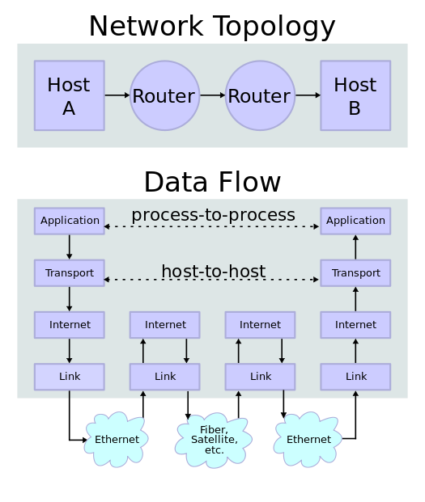
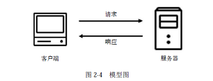

# 第三天

1. HTTP协议
2. 网页的基础知识
3. 使用python与web交互

## http

HTTP的全称是Hyper Text Transfer Protocol，中文名叫作超文本传输协议


通俗来讲，http是计算机通过网络进行通信的规则，是一个基于请求与响应，无状态的，短连接，应用层的协议，常基于TCP/IP协议传输数据。

四个基于：

+ 请求与响应：客户端发送请求，服务器端响应数据

+ 无状态的：协议对于事务处理没有记忆能力，客户端第一次与服务器建立连接发送请求时需要进行一系列的安全认证匹配等，因此增加页面等待时间，当客户端向服务器端发送请求，服务器端响应完毕后，两者断开连接，也不保存连接状态，一刀两断！恩断义绝！从此路人！下一次客户端向同样的服务器发送请求时，由于他们之前已经遗忘了彼此，所以需要重新建立连接。

+ 应用层：Http是属于应用层的协议，配合TCP/IP使用。

+ TCP/IP：Http使用TCP作为它的支撑运输协议。HTTP客户机发起一个与服务器的TCP连接，一旦连接建立，浏览器（客户机）和服务器进程就可以通过套接字接口访问TCP。


HTTPS的全称是Hyper Text Transfer Protocol over Secure Socket Layer，是以安全为目标的HTTP通道，简单讲是HTTP的安全版，即HTTP下加入SSL层，简称为HTTPS。


### 浏览器打开一个网页的请求过程
准备打开浏览器输入一个url

1. 域名解析
2. 发起tcp连接(三次握手建立连接)
3. 建立TCP连接后发起http请求
4. 服务器端响应http请求，浏览器得到html代码
5. 关闭tcp连接（非keepalive）
6. 浏览器解析html代码，并请求html代码中的资源
7. 浏览器对页面进行渲染呈现给用户

### URL

URL 格式
```
<scheme>://<user>:<password>@<host>:<port>/<path>;<params>?<query>#<frag>
<方案>://<用户>:<密码>@<主机>:<端口>/<路径>;<参数>?<查询>#<片段>
```
URL最重要的3个部分是方案(scheme)、主机(host)、和路径(path)

+ scheme  获取资源时要使用哪种协议（http，https，ftp，mailto，）
+ user  访问资源时需要的用户名
+ password  用户名后面可能要包含的密码，中间由冒号(:)分隔
+ host         域名/ip
+ port          端口
+ path         资源路径
+ ;params    参数，键/值对。URL中可以包含多个参数字段，它们相互之间以及与路径的其他部分之间用分号(;)分隔 
+ query    查询字符串，用"?"将其与URL的其余部分分隔开来 
+ frag    片段，一个网页中一部分资源的名字（访问html中的锚点）

使用python解析url
```
from urllib.parse import urlparse
obj = urlparse('https://baike.baidu.com/item/统一资源定位系统/5937042?fromtitle=url&fromid=110640')
print(obj)
print(obj.path)
print(obj.scheme)
```


URL编码 

url中只能出现以下字符

保留字符， 保留字符是那些具有特殊含义的字符，例如：/用于URL不同部分的分割符，还有? ; & 等等这些字符在url中有特殊意义
```
!	*	'	(	)	;	:	@	&	=	+	$	,	/	?	#	[	]
```
非保留字符
```
A	B	C	D	E	F	G	H	I	J	K	L	M	N	O	P	Q	R	S	T	U	V	W	X	Y	Z
a	b	c	d	e	f	g	h	i	j	k	l	m	n	o	p	q	r	s	t	u	v	w	x	y	z
0	1	2	3	4	5	6	7	8	9	-	_	.	~
```

除了以上字符其它字符和 出现在其它位置的保留字符（比如查询字符串里出现@,+，&）均需要进行编码。

ascii
首先需要把该字符的ASCII的值表示为两个16进制的数字，然后在其前面放置转义字符("%")，置入URI中的相应位置。
如`;`的编码为 `hex(ord(';'))`

非ascii码
对于非ASCII字符, 需要转换为UTF-8字节序,然后在其前面放置转义字符("%")
```
>>> s='中国'
>>> s.encode('utf-8')
b'\xe4\xb8\xad\xe5\x9b\xbd
```
在百度中搜索中国然后在开发者工具中查看请求的url

python url编码
对参数(key=value)编码
```
from urllib.parse import urlencode
data = {
    'kw': '中国'
}
print(urlencode(data))

```
对字符进行编码
```
from urllib.parse import quota
print(quote('中国'))
```


### 域名，IP，DNS

ipv4
IP地址由32位二进制数组成，为便于使用，常以XXX.XXX.XXX.XXX形式表现，每组XXX代表小于或等于255的10进制数，该表示方法称为点分十进制。例如维基媒体的一个IP地址是208.80.152.2。IP地址是唯一的。当前IPv4技术可能使用的IP地址最多可有4,294,967,296个（即2的32次方）

ipv6
从IPv4到IPv6最显著的变化就是网络地址的长度。IPv6中可能的地址有2的128次方个，IPv6地址为128位长，但通常写作8组，每组四个十六进制数的形式。例如：2001:0db8:85a3:08d3:1319:8a2e:0370:7344


网域名称（英语：Domain Name，简称：Domain），简称域名.是由一串用点分隔的字符组成的互联网上某一台计算机或计算机组的名称，用于在数据传输时标识计算机的电子方位。域名可以说是一个IP地址的代称，目的是为了便于记忆后者。例如，www.baidu.com是一个域名，和一个IP地址相对应。人们可以直接访问www.baidu.com来代替IP地址，然后域名系统（DNS）就会将它转化成便于机器识别的IP地址。这样，人们只需要记忆wikipedia.org这一串带有特殊含义的字符，而不需要记忆没有含义的数字。

域名的核心是域名系统（英语：Domain Name System，缩写：DNS），域名系统中的任何名称都是域名。在域名系统的层次结构中，各种域名都隶属于域名系统根域的下级。域名的第一级是顶级域，它包括通用顶级域，例如.com、.net和.org；以及国家和地区顶级域，例如.us、.cn和.tk。顶级域名下一层是二级域名，一级一级地往下。这些域名向人们提供注册服务，人们可以用它创建公开的互联网资源或运行网站。顶级域名的管理服务由对应的域名注册管理机构（域名注册局）负责，注册服务通常由域名注册商负责


dns解析过程


### 端口
tcp/udp 协议通讯时需要通过ip+端口来作为一个标识

### 计算机是如何通信的
计算机使用TCP/IP 协议栈进行通信

TCP/IP参考模型是一个抽象的分层模型，这个模型中，所有的TCP/IP系列网络协议都被归类到4个抽象的"层"中。每一抽象层创建在低一层提供的服务上，并且为高一层提供服务。 完成一些特定的任务需要众多的协议协同工作，这些协议分布在参考模型的不同层中的，因此有时称它们为一个协议栈
tcp/ip 分4层
+ 应用层 （ftp http smtp）
+ 传输层 （tcp，udp）
+ 网络层 （ip）
+ 链路层





osi模型

+ 应用层
+ 标识层
+ 会话层
+ 传输层
+ 网络层
+ 链路层
+ 物理层


协议封装
tcp/ip 协议栈从上往下逐层封帐


http封装


### HTTP协议



http请求方法

常见的请求方法有两种：GET和POST
其它请求方法


报文


+ start line 其实行
+ header     头部
+ body       报文实体 

Header


状态码


常见body类型

+ application/x-www-form-urlencoded 表单
+ multipart/form-data
+ application/json
+ text/xml

表单
```
POST http://www.example.com HTTP/1.1
Content-Type: application/x-www-form-urlencoded;charset=utf-8

title=test&sub%5B%5D=1&sub%5B%5D=2&sub%5B%5D=3

```

使用表单上传文件时
```
POST http://www.example.com HTTP/1.1
Content-Type:multipart/form-data; boundary=----WebKitFormBoundaryrGKCBY7qhFd3TrwA

------WebKitFormBoundaryrGKCBY7qhFd3TrwA
Content-Disposition: form-data; name="text"

title
------WebKitFormBoundaryrGKCBY7qhFd3TrwA
Content-Disposition: form-data; name="file"; filename="chrome.png"
Content-Type: image/png

PNG ... content of chrome.png ...
------WebKitFormBoundaryrGKCBY7qhFd3TrwA--

```

json数据
```
POST http://www.example.com HTTP/1.1 
Content-Type: application/json;charset=utf-8

{"title":"test","sub":[1,2,3]}
```

xml 数据
```
POST http://www.example.com HTTP/1.1 
Content-Type: text/xml

<?xml version="1.0"?>
<methodCall>
    <methodName>examples.getStateName</methodName>
    <params>
        <param>
            <value><i4>41</i4></value>
        </param>
    </params>
</methodCall>

```


## 网页的基础知识

网页可以分为三大部分——HTML、CSS和JavaScript
HTML是用来描述网页的一种语言，其全称叫作Hyper Text Markup Language，即超文本标记语言。网页包括文字、按钮、图片和视频等各种复杂的元素

不同类型的文字通过不同类型的标签来表示，如图片用img标签表示，视频用video标签表示，段落用p标签表示，它们之间的布局又常通过布局标签div嵌套组合而成，各种标签通过不同的排列和嵌套才形成了网页的框架

HTML定义了网页的结构，但是只有HTML页面的布局并不美观，可能只是简单的节点元素的排列，为了让网页看起来更好看一些，这里借助了CSS。

CSS，全称叫作Cascading Style Sheets，即层叠样式表。“层叠”是指当在HTML中引用了数个样式文件，并且样式发生冲突时，浏览器能依据层叠顺序处理。“样式”指网页中文字大小、颜色、元素间距、排列等格式

JavaScript，简称JS，是一种脚本语言。HTML和CSS配合使用，提供给用户的只是一种静态信息，缺乏交互性。我们在网页里可能会看到一些交互和动画效果，如下载进度条、提示框、轮播图等，这通常就是JavaScript的功劳


### 静态页面
在网页中我们能看到各种各样的信息，最常见的便是常规网页，它们对应着HTML代码，而最常抓取的便是HTML源代码。
此外，我们还可以看到各种二进制数据，如图片、视频和音频等。另外，还可以看到各种扩展名的文件，如CSS、JavaScript和配置文件等，


### 动态页面

有时候，我们查看网页的源代码实际和浏览器中看到的不一样。

这是一个非常常见的问题。现在网页越来越多地采用Ajax、前端模块化工具来构建，整个网页可能都是由JavaScript渲染出来的，也就是说原始的HTML代码就是一个空壳
比如 https://www.12306.cn/index/

### 带认证的页面（cookie、session）

HTTP的一个特点，叫作无状态。HTTP的无状态是指HTTP协议对事务处理是没有记忆能力的，也就是说服务器不知道客户端是什么状态。当我们向服务器发送请求后，服务器解析此请求，然后返回对应的响应，服务器负责完成这个过程，而且这个过程是完全独立的，服务器不会记录前后状态的变化，也就是缺少状态记录。

两个用于保持HTTP连接状态的技术就出现了，它们分别是Session和Cookies。Session在服务端，也就是网站的服务器，用来保存用户的会话信息；Cookies在客户端，也可以理解为浏览器端，有了Cookies，浏览器在下次访问网页时会自动附带上它发送给服务器，服务器通过识别Cookies并鉴定出是哪个用户，然后再判断用户是否是登录状态，然后返回对应的响应。


我们可以理解为Cookies里面保存了登录的凭证，有了它，只需要在下次请求携带Cookies发送请求而不必重新输入用户名、密码等信息重新登录了。


## python与web交互
python 有各种与web交互的模块
+ requests模块，发起http请求并取得相应
+ beautifulsoup4(bs4) 解析html内容提取元素
+ selenium 模拟浏览器操作


### Request模块

[requests](http://docs.python-requests.org/zh_CN/latest/user/quickstart.html)
文档

get 请求
```
import requests

r = requests.get("https://www.baidu.com")
print(r.text)
print(r.status_code)
print(r.cookies)
```

带参数的get请求

```
import requests

data = {'name': 'test', 'age': 18}

r = requests.get("http://httpbin.org/get", params=data)
print(r.text)

```

post请求

```
import requests

data = {'name': 'test', 'age': 18}

r = requests.post("http://httpbin.org/post", data=data)
print(r.text)

```

自定义header
```
import requests

r = requests.get('https://www.zhihu.com/explore')
print(r.text)

import requests

headers= {
        'User-Agent': 'Mozilla/5.0 (Windows NT 10.0; WOW64) AppleWebKit/537.36 (KHTML, like Gecko) Chrome/70.0.3538.102 Safari/537.36'
}
r = requests.get('https://www.zhihu.com/explore', headers=headers)

print(r.text)
```


### Beautiful Soup模块

[bs4](https://beautifulsoup.readthedocs.io/zh_CN/v4.4.0/)文档

```
from bs4 import BeautifulSoup

html_doc = """
<html><head><title>The Dormouse's story</title></head>
<body>
<p class="title"><b>The Dormouse's story</b></p>

<p class="story">Once upon a time there were three little sisters; and their names were
<a href="http://example.com/elsie" class="sister" id="link1">Elsie</a>,
<a href="http://example.com/lacie" class="sister" id="link2">Lacie</a> and
<a href="http://example.com/tillie" class="sister" id="link3">Tillie</a>;
and they lived at the bottom of a well.</p>

<p class="story">...</p>
"""

soup = BeautifulSoup(html_doc, 'html.parser')

print(soup.title)
print(soup.p)
print(soup.p['class'])
print(soup.find_all('a'))
```

[css选择器](http://www.w3school.com.cn/cssref/css_selectors.asp)

抓取例子

```
from bs4 import BeautifulSoup
import requests


url = "https://movie.douban.com/"

headers= {
        'User-Agent': 'Mozilla/5.0 (Windows NT 10.0; WOW64) AppleWebKit/537.36 (KHTML, like Gecko) Chrome/70.0.3538.102 Safari/537.36'
}

r = requests.get(url, headers=headers)
html_doc = r.text
soup = BeautifulSoup(html_doc, 'html.parser')

element = soup.select('#billboard > div.billboard-bd > table')[0]

for item in element.find_all('a'):
    print(item.text)


```
### 如何访问有认证的页面
```
import requests
from bs4 import BeautifulSoup

headers= {
        'User-Agent': 'Mozilla/5.0 (Windows NT 10.0; WOW64) AppleWebKit/537.36 (KHTML, like Gecko) Chrome/70.0.3538.102 Safari/537.36'
}
url = "http://116.196.114.148:8000/admin/login/?next=/admin/"
s = requests.session()
r = s.get(url)
bs = BeautifulSoup(r.content, 'html.parser')
e = bs.select('#login-form > input[type=hidden]')
csrftoken = e[0].attrs["value"]

data = {
    "csrfmiddlewaretoken": csrftoken,
    "username": "admin",
    "password": "jia12345",
    "next": "/admin/"

}

rt = s.post(url,headers=headers,data=data)
print(rt.status_code)


```

### 简单爬虫
```
import requests
from bs4 import BeautifulSoup
import queue

start_page = "http://www.163.com"
domain = "163.com"
url_queue = queue.Queue()
seen = set()

seen.add(start_page)
url_queue.put(start_page)


def sotre(url):
    pass

def extract_urls(url):
    urls = []
    html = requests.get(url)
    soup = BeautifulSoup(html.content, "html.parser")
    for e in soup.findAll('a'):
        url = e.attrs.get('href', '#')
        urls.append(url)
    return urls


while True:

    if not url_queue.empty():

        current_url = url_queue.get()
        print(current_url)
        sotre(current_url)
        for next_url in extract_urls(current_url):
            if next_url not in seen and domain in next_url:
                seen.add(next_url)
                url_queue.put(next_url)
    else:
        break

```


