# 第九天
实战http接口测试平台HAT

## 功能模块
+ dashboard
+ 项目管理
+ 模块管理
+ 用例管理
+ 报告管理
+ 定时任务
+ 环境管理

## 系统架构

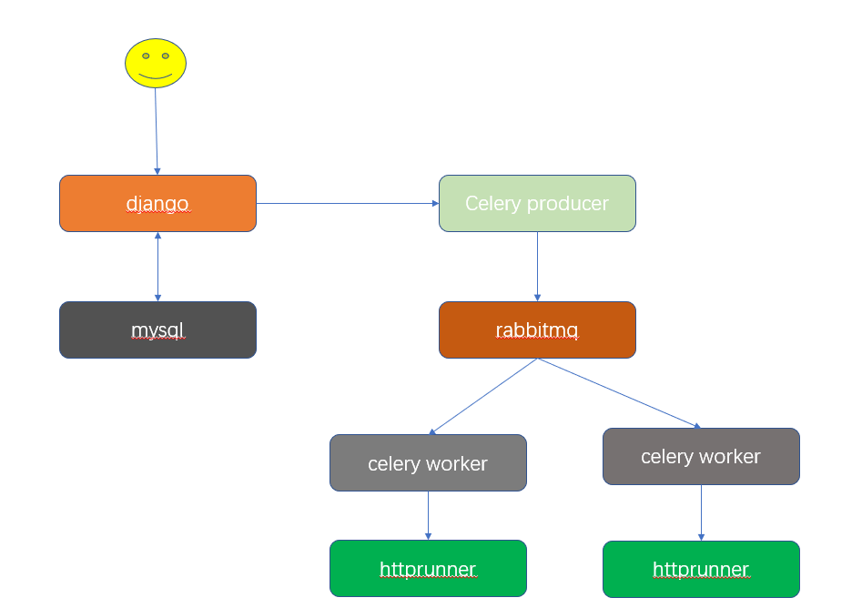
+ httprunner 接口测试框架
+ redis 缓存队列
+ celery 分布式任务系统

## 数据库表结构

项目表ProjectInfo
| Field            | Type         | Null | Key | Default | Extra          |
|------------------|--------------|------|-----|---------|----------------|
| id               | int(11)      | NO   | PRI | NULL    | auto_increment |
| create_time      | datetime(6)  | NO   |     | NULL    |                |
| update_time      | datetime(6)  | NO   |     | NULL    |                |
| project_name     | varchar(50)  | NO   | UNI | NULL    |                |
| responsible_name | varchar(20)  | NO   |     | NULL    |                |
| test_user        | varchar(100) | NO   |     | NULL    |                |
| dev_user         | varchar(100) | NO   |     | NULL    |                |
| publish_app      | varchar(100) | NO   |     | NULL    |                |
| simple_desc      | varchar(100) | YES  |     | NULL    |                |
| other_desc       | varchar(100) | YES  |     | NULL    |                |

模块表

| Field             | Type         | Null | Key | Default | Extra          |
|-------------------|--------------|------|-----|---------|----------------|
| id                | int(11)      | NO   | PRI | NULL    | auto_increment |
| create_time       | datetime(6)  | NO   |     | NULL    |                |
| update_time       | datetime(6)  | NO   |     | NULL    |                |
| module_name       | varchar(50)  | NO   |     | NULL    |                |
| test_user         | varchar(50)  | NO   |     | NULL    |                |
| simple_desc       | varchar(100) | YES  |     | NULL    |                |
| other_desc        | varchar(100) | YES  |     | NULL    |                |
| belong_project_id | int(11)      | NO   | MUL | NULL    |                |

用例表

| Field            | Type          | Null | Key | Default | Extra          |
|------------------|---------------|------|-----|---------|----------------|
| id               | int(11)       | NO   | PRI | NULL    | auto_increment |
| create_time      | datetime(6)   | NO   |     | NULL    |                |
| update_time      | datetime(6)   | NO   |     | NULL    |                |
| name             | varchar(50)   | NO   |     | NULL    |                |
| belong_project   | varchar(50)   | NO   |     | NULL    |                |
| author           | varchar(20)   | NO   |     | NULL    |                |
| request          | longtext      | NO   |     | NULL    |                |
| belong_module_id | int(11)       | NO   | MUL | NULL    |                |
| include          | varchar(1024) | YES  |     | NULL    |                |

报告表

| Field       | Type        | Null | Key | Default | Extra          |
|-------------|-------------|------|-----|---------|----------------|
| id          | int(11)     | NO   | PRI | NULL    | auto_increment |
| create_time | datetime(6) | NO   |     | NULL    |                |
| update_time | datetime(6) | NO   |     | NULL    |                |
| report_name | varchar(40) | NO   |     | NULL    |                |
| start_at    | varchar(40) | YES  |     | NULL    |                |
| status      | tinyint(1)  | NO   |     | NULL    |                |
| testsRun    | int(11)     | NO   |     | NULL    |                |
| successes   | int(11)     | NO   |     | NULL    |                |
| reports     | longtext    | NO   |     | NULL    |                |

用户表

| Field       | Type         | Null | Key | Default | Extra          |
|-------------|--------------|------|-----|---------|----------------|
| id          | int(11)      | NO   | PRI | NULL    | auto_increment |
| create_time | datetime(6)  | NO   |     | NULL    |                |
| update_time | datetime(6)  | NO   |     | NULL    |                |
| username    | varchar(20)  | NO   | UNI | NULL    |                |
| password    | varchar(20)  | NO   |     | NULL    |                |
| email       | varchar(254) | NO   | UNI | NULL    |                |
| status      | int(11)      | NO   |     | NULL    |                |


## 测试环境
被测服务一个flask应用[api_server.py](./Chapter-09-code/demo/api_server.py)

`pip install flask`

该应用作为被测服务，主要有两类接口：

* 权限校验，获取 token
* 支持 CRUD 操作的 RESTful APIs，所有接口的请求头域中都必须包含有效的 token

下载文件api_server.py,执行以下命令运行
`python api_server.py `
api_server.py包括一下功能
1. index 返回hello world
2. get_token 获取认证token
3. get_users 获取用户列表
4. create_user 创建用户
5. get_user 获取用户信息
6. update_user 更新用户信息
7. delete_user 删除用户信息

### 简单例子
1. 新建项目
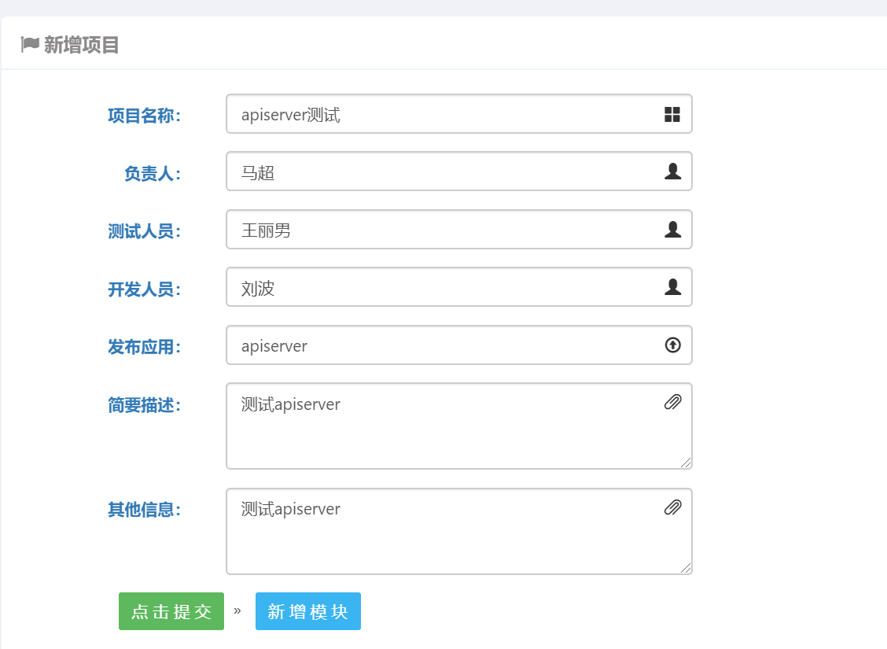

2. 新增模块


3. 新增测试用例
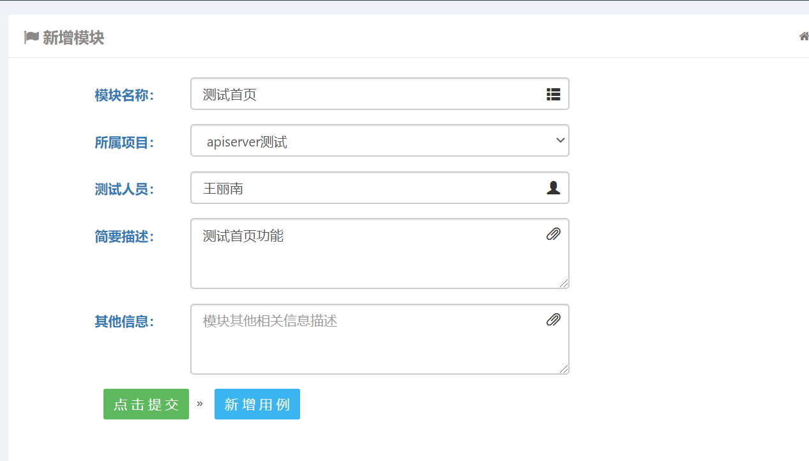
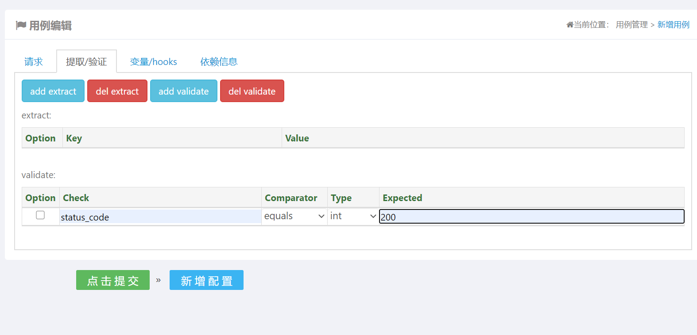
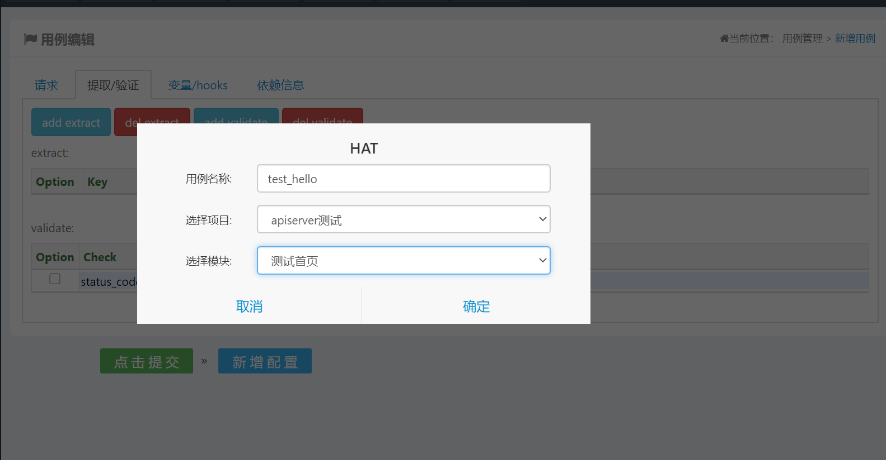

4. 运行用例

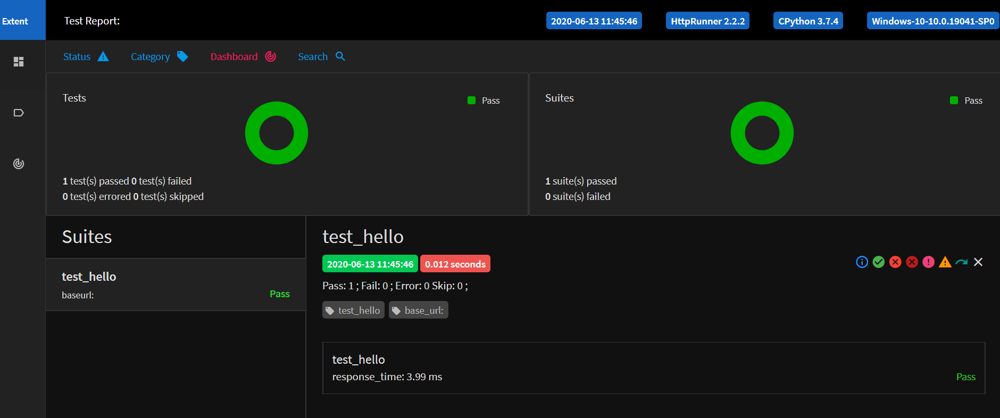

### 高级用例
一、get_token 用例
1. 编写debugtalk
```
#debugtalk.py

import hashlib
import hmac
import random
import string

SECRET_KEY = "DebugTalk"

def gen_random_string(str_len):
    random_char_list = []
    for _ in range(str_len):
        random_char = random.choice(string.ascii_letters + string.digits)
        random_char_list.append(random_char)

    random_string = ''.join(random_char_list)
    return random_string

def get_sign(*args):
    content = ''.join(args).encode('ascii')
    sign_key = SECRET_KEY.encode('ascii')
    sign = hmac.new(sign_key, content, hashlib.sha1).hexdigest()
    return sign
```

2. 定义变量
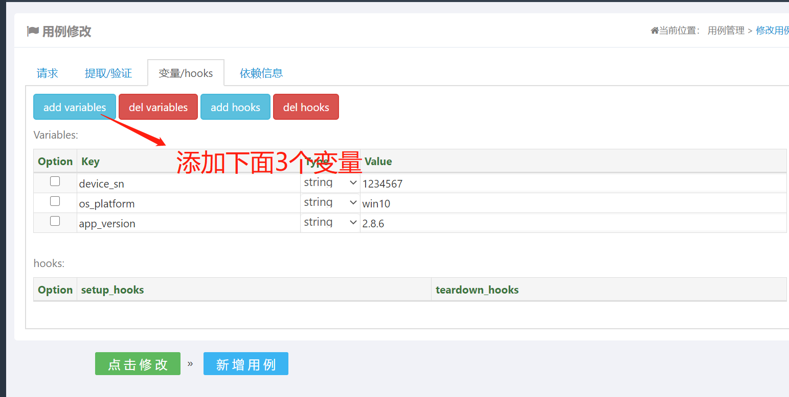

|变量名     | 变量值                   |
|----------|--------------------------|
| device_sn  | ${gen_random_string(15)}|
| os_platform| win10                  |
| app_version| 2.8.6                   |

注： ${gen_random_string(15)} 是debugtalk中定义的函数gen_random_string(str_len)       |

3. 定义请求方法和数据
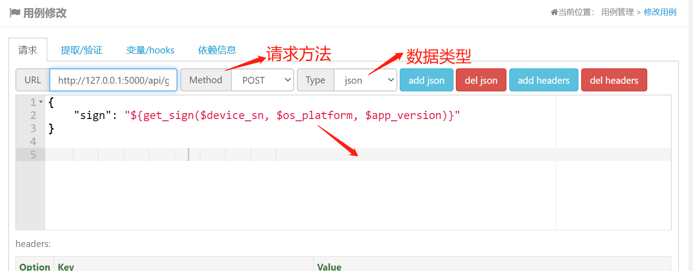

url http://127.0.0.1:5000/api/get-token

方法 post
json
```
{
    "sign": "${get_sign($device_sn, $os_platform, $app_version)}"
}
```
get_sign 为debugtalk中定义的函数$和大括号不能丢
参数为我们刚才定义的变更
4. 定义header
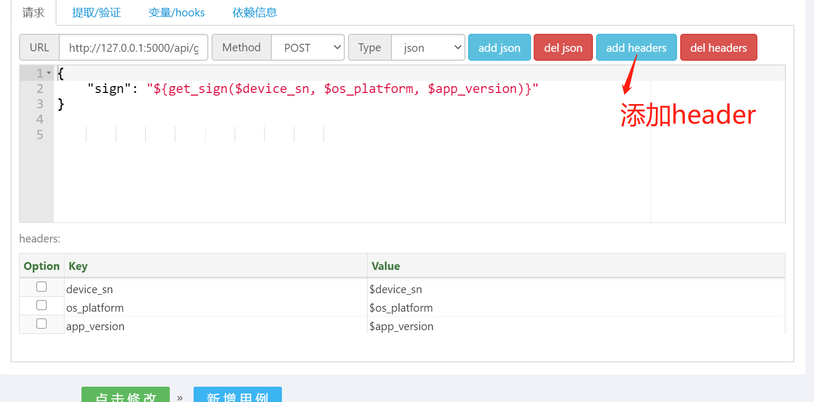

|key     | value                |
|----------|--------------------|
| device_sn  | $device_sn       |
| os_platform| $os_platform     |
| app_version| $app_version     |

二、create_user 用例
1. 定义数据与header
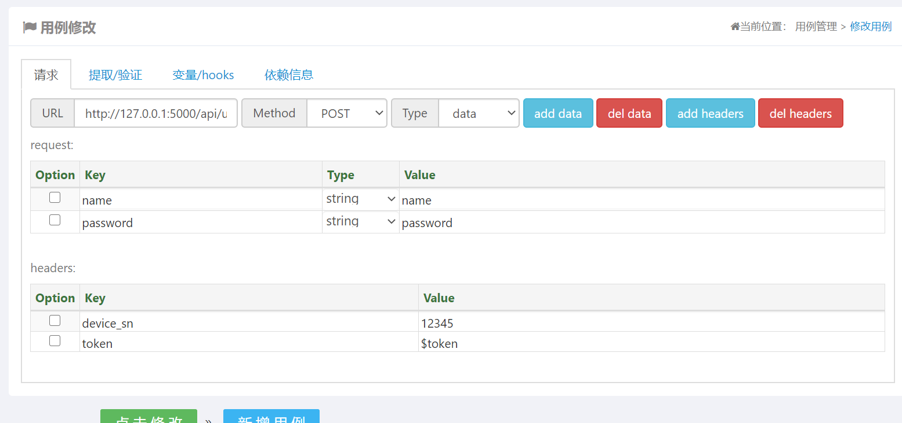

data
|key     | value                |
|----------|--------------------|
| name  | name       |
| password| password     |

header
|key     | value                |
|----------|--------------------|
| device_sn| 12345     |
| token    | $token    |

2. 断言

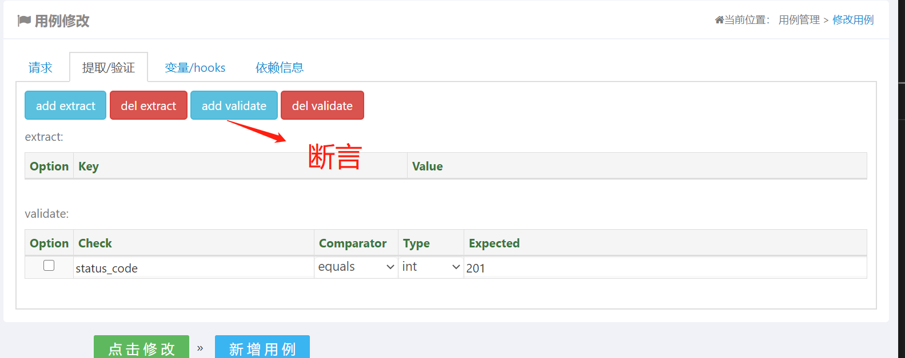
status_code 201

3. 添加依赖

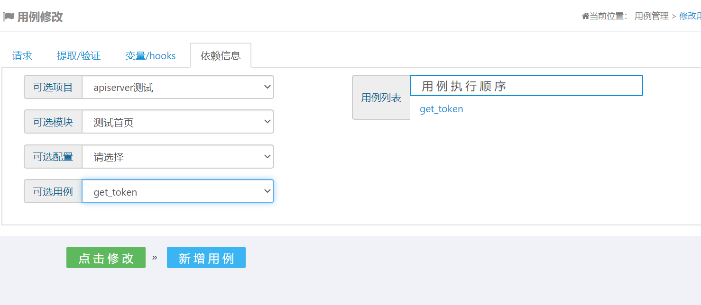

创建用户接口需要一个token，该token可以通过get_token 接口获取

前提，需要get_token 接口添加一个提取
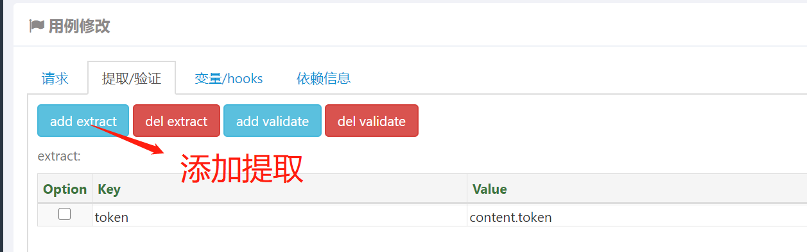
token    content.token


