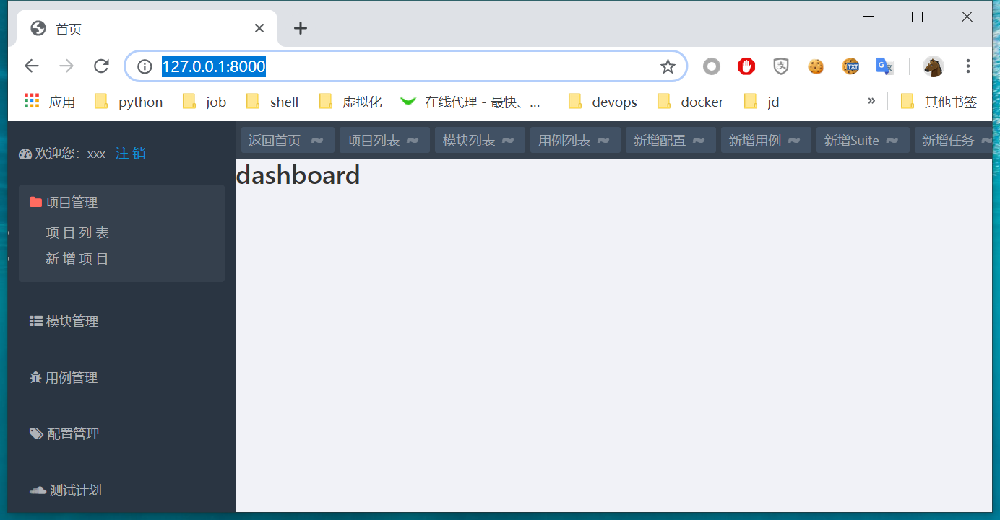

# 第十天

## 新建项目

1. 创建项目 

    `django-admin startproject hat`

2. 创建app

    `python  manage.py startapp httpapitest`

3. 修改settings.py 添加 httpapitest到 INSTALLED_APPS

```
INSTALLED_APPS = [
    'django.contrib.admin',
    'django.contrib.auth',
    'django.contrib.contenttypes',
    'django.contrib.sessions',
    'django.contrib.messages',
    'django.contrib.staticfiles',
    'httpapitest',
]
```

4. 启动开发服务器

    `python manage.py runserver`

访问127.0.0.1:8000，显示django界面说明，一切ok

5. 数据库
安装mysql

windows系统在群里下载mysql文件，解压即可
安装python 的mysqlclient 模块；python通过改模块连接mysql数据库

    `pip install --only-binary :all: mysqlclient`
    --only-binary 安装编译好的二进制
mac 系统
```
brew install mysql
brew services start mysql
pip3 install mysqlclient
```
如果没有brew命令,执行以下命令进行安装
`/bin/bash -c "$(curl -fsSL https://raw.githubusercontent.com/Homebrew/install/master/install.sh)"`

创建数据库

    `CREATE DATABASE `hat` /*!40100 DEFAULT CHARACTER SET utf8 */;`

    

6. 配置mysql数据库

修改settings.py
```
DATABASES = {
    #'default': {
    #    'ENGINE': 'django.db.backends.sqlite3',
    #    'NAME': os.path.join(BASE_DIR, 'db.sqlite3'),
    #}
    'default': {
        'ENGINE': 'django.db.backends.mysql',
        'NAME': 'hat',  # 新建数据库名
        'USER': 'root',  # 数据库登录名
        'PASSWORD': '',  # 数据库登录密码
        'HOST': '127.0.0.1',  # 数据库所在服务器ip地址
        'PORT': '3306',  # 监听端口 默认3306即可
        }
}
```

6. 首次migrate,
    
    `python  manage.py migrate`


7. 配置静态文件路径

```
STATIC_URL = '/static/'
STATIC_DIR = os.path.join(BASE_DIR, 'static')
STATICFILES_DIRS = [STATIC_DIR, ]
```
在manage.py同级目录创建static目录

8. 配置模板路径

```
TEMPLATE_DIR = os.path.join(BASE_DIR, 'templates')
TEMPLATES = [
    {
        'BACKEND': 'django.template.backends.django.DjangoTemplates',
        'DIRS': [TEMPLATE_DIR,],
        'APP_DIRS': True,
        'OPTIONS': {
            'context_processors': [
                'django.template.context_processors.debug',
                'django.template.context_processors.request',
                'django.contrib.auth.context_processors.auth',
                'django.contrib.messages.context_processors.messages',
                'django.template.context_processors.media',
            ],
        },
    },
]
```

在manage.py同级目录创建static目录,创建templates目录

9. 配置项目目录下的urls.py 将匹配/httapitest的url 路由到app httpapitest的urls.py
```
from django.contrib import admin
from django.urls import path, include
from httpapitest import views

urlpatterns = [
    path('admin/', admin.site.urls),
    path('',views.index),
    path('httpapitest/', include('httpapitest.urls')),
    
]
```
此时runserver会报错，因为没有index视图函数

10. 在httpapitest目录下新建urls.py文件
```

from django.urls import path
from httpapitest import views

urlpatterns = [
    path('', views.index, name='index'),
    
]
```
此时runserver会报错，因为没有index视图函数

11. 创建第一个视图index

```
from django.shortcuts import render
from django.shortcuts import HttpResponse

# Create your views here.
def index(request):
    return HttpResponse("hello hat")

```
打开http://127.0.0.1:8000 查看

## 测试项目管理
实现项目的增删改查功能

### 搭建网站页面架构

在templates目录下创建base.html 模板
```
<!doctype html>
<html class="no-js" lang="zh-CN">
<head>

    <meta charset="utf-8">
    <meta http-equiv="X-UA-Compatible" content="IE=edge">
    <title></title>
    <meta name="keywords" content="index">
    <meta name="viewport" content="width=device-width, initial-scale=1, maximum-scale=1, user-scalable=yes">
    <meta name="renderer" content="webkit">
    <meta http-equiv="Cache-Control" content="no-siteapp"/>

    
    <meta name="apple-mobile-web-app-title" content="HAT"/>
    <link href="https://cdn.bootcss.com/bootstrap/3.3.7/css/bootstrap.min.css" rel="stylesheet" media="screen"/>
    <link rel="stylesheet" href="https://cdn.bootcss.com/bootstrap-fileinput/4.4.8/css/fileinput.css"/>
    <script src="https://cdn.bootcss.com/jquery/2.1.1/jquery.min.js"></script>
    <script src="https://cdn.bootcss.com/bootstrap-fileinput/4.4.8/js/fileinput.js"></script>
    <script src="http://cdn.static.runoob.com/libs/bootstrap/3.3.7/js/bootstrap.min.js"></script>
    <script src="https://cdn.bootcss.com/bootstrap-fileinput/4.4.8/js/fileinput.min.js"></script>
    <link rel="stylesheet" href="https://cdn.bootcss.com/bootstrap-fileinput/4.4.8/css/fileinput.min.css"/>

    <link rel="stylesheet" href="https://cdn.bootcss.com/amazeui/2.7.2/css/amazeui.min.css"/>
    <link rel="stylesheet" href="">
    <link rel="stylesheet" href="">

    <script src="https://cdn.bootcss.com/amazeui/2.7.2/js/amazeui.min.js"></script>
    <script src="https://cdn.bootcss.com/jquery.serializeJSON/2.9.0/jquery.serializejson.min.js"></script>
    <script src="https://cdn.bootcss.com/ace/1.2.6/ace.js" type="text/javascript"
            charset="utf-8"></script>
    <script src="https://cdn.bootcss.com/ace/1.2.6/ext-language_tools.js" type="text/javascript"
            charset="utf-8"></script>
    <script src="//apps.bdimg.com/libs/jqueryui/1.10.4/jquery-ui.min.js"></script>

    <script src=""></script>
    <script src=""></script>


</head>
<body class="modal-open">


<div class="am-modal am-modal-alert" tabindex="-1" id="my-alert">
    <div class="am-modal-dialog">
        <div class="am-modal-hd">HAT</div>
        <div class="am-modal-bd" id="my-alert_print">
            Sorry，服务器可能开小差啦, 请重试!
        </div>
        <div class="am-modal-footer">
            <span class="am-modal-btn">确定</span>
        </div>
    </div>
</div>
<div class="am-cf admin-main">

    <div class="nav-navicon admin-main admin-sidebar">


        <div class="sideMenu am-icon-dashboard" style="color:#aeb2b7; margin: 10px 0 0 0;"> 欢迎您：{{ request.session.now_account }} &nbsp;&nbsp;<a
                href='#'>注 销</a></div>
        <div class="sideMenu">
            
            <h3 class="am-icon-folder on"><em></em> <a href="#">项目管理</a></h3>
            
            <h3 class="am-icon-folder"><em></em> <a href="#">项目管理</a></h3>
            
            <ul>
                <li><a href="#">项 目 列 表</a></li>
                <li><a href="#">新 增 项 目</a></li>
                <li><a href="#">debugtalk.py</a></li>
            </ul>
            
            <h3 class="am-icon-th-list on"><em></em> <a href="#"> 模块管理</a></h3>
             
            <h3 class="am-icon-th-list"><em></em> <a href="#"> 模块管理</a></h3>
            
            <ul>
                <li><a href="#">模 块 列 表</a></li>
                <li><a href="#">新 增 模 块</a></li>
            </ul>
            
            <h3 class="am-icon-bug on"><em></em> <a href="#">用例管理</a></h3>
            
            <h3 class="am-icon-bug"><em></em> <a href="#">用例管理</a></h3>
            
            <ul>
                <li><a href="#">新 增 用 例</a></li>
                <li><a href="#">用 例 列 表</a></li>
            </ul>

            <h3 class="am-icon-tags"><em></em> <a href="#">配置管理</a></h3>
            <ul>
                <li><a href="#">新 增 配 置</a></li>
                <li><a href="#">配 置 列 表</a></li>
            </ul>

            <h3 class="am-icon-soundcloud"><em></em> <a href="#">测试计划</a></h3>
            <ul>
                <li><a href="#">定 时 任 务</a></li>
            </ul>


            <h3 class="am-icon-jsfiddle"><em></em> <a href="#">报告管理</a></h3>
            <ul>
                <li><a href="#">查看报告</a></li>
            </ul>
            <h3 class="am-icon-gears"><em></em> <a href="#">系统设置</a></h3>
            <ul>
                <li><a href="#">运 行 环 境</a></li>
            </ul>
        </div>
        <!-- sideMenu End -->
    </div>

    <div class="daohang">
        <ul>
            <li>
                <button type="button" class="am-btn am-btn-default am-radius am-btn-xs"
                        onclick="location=''">返回首页
                    <a href="" class="am-close am-close-spin">~</a></button>
            </li>
            <li>
                <button type="button" class="am-btn am-btn-default am-radius am-btn-xs"
                        onclick="location='#'">项目列表<a
                        href="#" class="am-close am-close-spin">~</a>
                </button>
            </li>
            <li>
                <button type="button" class="am-btn am-btn-default am-radius am-btn-xs"
                        onclick="location='#' %}'">模块列表<a
                        href="#" class="am-close am-close-spin">~</a>
                </button>
            </li>
            <li>
                <button type="button" class="am-btn am-btn-default am-radius am-btn-xs"
                        onclick="location='#'">用例列表<a
                        href="#" class="am-close am-close-spin">~</a>
                </button>
            </li>

            <li>
                <button type="button" class="am-btn am-btn-default am-radius am-btn-xs"
                        onclick="location='#'">新增配置<a
                        href="#" class="am-close am-close-spin">~</a>
                </button>
            </li>
            <li>
                <button type="button" class="am-btn am-btn-default am-radius am-btn-xs"
                        onclick="location='#'">新增用例<a
                        href="#" class="am-close am-close-spin">~</a>
                </button>
            </li>
            <li>
                <button type="button" class="am-btn am-btn-default am-radius am-btn-xs"
                        onclick="location='#'">新增任务<a
                        href="#" class="am-close am-close-spin">~</a>
                </button>
            </li>

        </ul>
    </div>

    

    
    <script type="text/javascript">
        jQuery(".sideMenu").slide({
            titCell: "h3", //鼠标触发对象
            targetCell: "ul", //与titCell一一对应，第n个titCell控制第n个targetCell的显示隐藏
            effect: "slideDown", //targetCell下拉效果
            delayTime: 300, //效果时间
            triggerTime: 150, //鼠标延迟触发时间（默认150）
            defaultPlay: true,//默认是否执行效果（默认true）
            returnDefault: false //鼠标从.sideMen移走后返回默认状态（默认false）
        });
    </script>
</div>

</body>
</html>

```

### 创建index.html模板

```

首页


    <div class="admin">
    <h1> dashboard </h1>

    </div>

```

### 添加静态文件

将qq群的assets.zip 解压 放到static目录下

### 更新index视图
```
from django.shortcuts import render
from django.shortcuts import HttpResponse

# Create your views here.
def index(request):
    return render(request, 'index.html')

```

打开http://127.0.0.1:8000/ 如下：



### 在models.py创建项目相关的modle 类
```
from django.db import models

# Create your models here.

class BaseTable(models.Model):
    create_time = models.DateTimeField('创建时间', auto_now_add=True)
    update_time = models.DateTimeField('更新时间', auto_now=True)

    class Meta:
        abstract = True
        verbose_name = "公共字段表"
        db_table = 'BaseTable'

class Project(BaseTable):
    class Meta:
        verbose_name = '项目信息'
        db_table = 'ProjectInfo'

    project_name = models.CharField('项目名称', max_length=50, unique=True, null=False)
    responsible_name = models.CharField('负责人', max_length=20, null=False)
    test_user = models.CharField('测试人员', max_length=100, null=False)
    dev_user = models.CharField('开发人员', max_length=100, null=False)
    publish_app = models.CharField('发布应用', max_length=100, null=False)
    simple_desc = models.CharField('简要描述', max_length=100, null=True)
    other_desc = models.CharField('其他信息', max_length=100, null=True)


```
BaseTable 类里面有两个字段create_time、update_time，这两个字段在其他多个类里也要用到，其它需要这两个字段的类继续BaseTable即可；

执行python manage.py makemigrations
```
python manage.py makemigrations
python manage.py migrate
```
### 定义视图
先定义空视图
```
def project_add(request):
    pass

def project_list(request):
    pass

def project_edit(request):
    pass

def project_delete(request):
    pass

```

### 定义url

```

from django.urls import path
from httpapitest import views

urlpatterns = [
    path('', views.index, name='index'),
    path('project/list', views.project_list, name='project_list'),
    path('project/add', views.project_add, name='project_add'),
    path('project/edit', views.project_edit, name='project_edit'),
    path('project/delete', views.project_delete, name='project_delete'),
]
```

### 修改project_add视图
```
@csrf_exempt
def project_add(request):
    if request.is_ajax():
        project = json.loads(request.body.decode('utf-8'))
        if project.get('project_name') == '':
            msg = '项目名称不能为空'
            return HttpResponse(msg)
        if project.get('responsible_name') == '':
            msg = '负责人不能为空'
            return HttpResponse(msg)
        if project.get('test_user') == '':
            msg = '测试人员不能为空'
            return HttpResponse(msg)
        if project.get('dev_user') == '':
            msg = '开发人员不能为空'
            return HttpResponse(msg)
        if project.get('publish_app') == '':
            msg = '发布应用不能为空'
            return HttpResponse(msg)
        if Project.objects.filter(project_name=project.get('project_name')):
            msg = "项目已经存在"
            return HttpResponse(msg)
        else:
            p = Project()
            p.project_name = project.get('project_name')
            p.responsible_name = project.get('responsible_name')
            p.test_user = project.get('test_user')
            p.dev_user = project.get('dev_user')
            p.publish_app = project.get('publish_app')
            p.simple_desc = project.get('simple_desc')
            p.other_desc = project.get('other_desc')
            p.save()
            #d = DebugTalk()
            #d.belong_project = p
            #d.save()
            return HttpResponse("添加成功")

    if request.method == 'GET':
        return render(request, 'project_add.html')
```
导入
```
from django.views.decorators.csrf import csrf_exempt`
import json
from httpapitest.models import Project
```
### 新建project_add.html 模板
templates/project_add.html
```

新增项目



    <div class=" admin-content">

        <div class="admin-biaogelist">
            <div class="listbiaoti am-cf">
                <ul class="am-icon-flag on"> 新增项目</ul>
                <dl class="am-icon-home" style="float: right;"> 当前位置： 项目管理 > <a href="#">新增项目</a></dl>
            </div>
            <div class="fbneirong">
                <form class="form-horizontal" id="project_add">
                    <div class="form-group  has-feedback">
                        <label class="control-label col-md-2 text-primary" for="project_name">项目名称：</label>
                        <div class="col-md-5">
                            <input type="text" class="form-control" id="project_name"
                                   aria-describedby="inputSuccess3Status" name="project_name" placeholder="请输入项目名 称"
                                   value="">
                            <span class="glyphicon glyphicon-th-large form-control-feedback" aria-hidden="true"></span>
                        </div>
                    </div>
                    <div class="form-group  has-feedback">
                        <label class="control-label col-md-2 text-primary" for="responsible_name">负责人：</label>
                        <div class="col-md-5">
                            <input type="text" class="form-control" id="responsible_name" name="responsible_name"
                                   aria-describedby="inputSuccess3Status" placeholder="请指定项目负责人" value="">
                            <span class="glyphicon glyphicon-user form-control-feedback" aria-hidden="true"></span>
                        </div>
                    </div>

                    <div class="form-group  has-feedback">
                        <label class="control-label col-md-2 text-primary" for="test_user">测试人员：</label>
                        <div class="col-md-5">
                            <input type="text" class="form-control" id="test_user" name="test_user"
                                   aria-describedby="inputSuccess3Status" placeholder="请输入参与的测试人员" value="">
                            <span class="glyphicon glyphicon-user form-control-feedback" aria-hidden="true"></span>
                        </div>
                    </div>

                    <div class="form-group  has-feedback">
                        <label class="control-label col-md-2 text-primary" for="dev_user">开发人员：</label>
                        <div class="col-md-5">
                            <input type="text" class="form-control" id="dev_user" name="dev_user"
                                   aria-describedby="inputSuccess3Status" placeholder="请输入项目参与的研发人员" value="">
                            <span class="glyphicon glyphicon-user form-control-feedback" aria-hidden="true"></span>
                        </div>
                    </div>

                    <div class="form-group  has-feedback">
                        <label class="control-label col-md-2 text-primary" for="publish_app">发布应用：</label>
                        <div class="col-md-5">
                            <input type="text" class="form-control" id="publish_app" name="publish_app"
                                   aria-describedby="inputSuccess3Status" placeholder="请输入发布的应用" value="">
                            <span class="glyphicon glyphicon-upload form-control-feedback" aria-hidden="true"></span>
                        </div>
                    </div>

                    <div class="form-group  has-feedback">
                        <label class="control-label col-md-2 text-primary" for="simple_desc">简要描述：</label>
                        <div class="col-md-5">
                            <textarea type="text" rows="3" class="form-control" id="simple_desc" name="simple_desc"
                                      aria-describedby="inputSuccess3Status" placeholder="项目简单概述"></textarea>
                            <span class="glyphicon glyphicon-paperclip form-control-feedback" aria-hidden="true"></span>
                        </div>
                    </div>

                    <div class="form-group  has-feedback">
                        <label class="control-label col-md-2 text-primary" for="other_desc">其他信息：</label>
                        <div class="col-md-5">
                            <textarea type="text" rows="3" class="form-control" id="other_desc" name="other_desc"
                                      aria-describedby="inputSuccess3Status" placeholder="项目其他相关信息描述"></textarea>
                            <span class="glyphicon glyphicon-paperclip form-control-feedback" aria-hidden="true"></span>
                        </div>
                    </div>
                    <div class="am-form-group am-cf">
                        <div class="you" style="margin-left: 8%;">
                            <button type="button" class="am-btn am-btn-success am-radius" id="send"
                                    onclick="info_ajax('#project_add', '')">点 击 提 交
                            </button>&nbsp;
                            &raquo; &nbsp;
                            <a type="submit" href="#" class="am-btn am-btn-secondary am-radius">新 增 模
                                块</a>

                        </div>
                    </div>
                </form>


            </div>
        </div>
    </div>

```

### commons.js文件
static/assets/js/common.js
```
/*表单信息异步传输*/
function info_ajax(id, url) {
    var data = $(id).serializeJSON();
    if (id === '#add_task') {
        var include = [];
        var i = 0;
        $("ul#pre_case li a").each(function () {
            include[i++] = [$(this).attr('id'), $(this).text()];
        });
        data['module'] = include;
    }

    $.ajax({
        type: 'post',
        url: url,
        data: JSON.stringify(data),
        contentType: "application/json",
        success: function (data) {
            if (data.indexOf('/httpapitest/') !== -1) {
                    window.location.href = data;
            } else {
                    myAlert(data);
            }    
        }
        ,
        error: function () {
            myAlert('Sorry，服务器可能开小差啦, 请重试!');
        }
    });

}


/*提示 弹出*/
function myAlert(data) {
    $('#my-alert_print').text(data);
    $('#my-alert').modal({
        relatedTarget: this
    });
}


```
使用浏览器打开http://127.0.0.1:8000/httpapitest/project/add 测试添加项目功能


### 修改project_list视图

```
@csrf_exempt
def project_list(request):
    if request.method == 'GET':
        projects = Project.objects.all().order_by("-update_time")
        project_name = request.GET.get('project','All')
        #env = Env.objects.all()
        user = request.GET.get('user', '负责人')
        info = {'belong_project': project_name, 'user':user}

        
        if project_name != "All":
            rs = Project.objects.filter(project_name=project_name)
        elif user != "负责人":
            rs = Project.objects.filter(responsible_name=user)
        else:
            rs = projects
        paginator = Paginator(rs,5)
        page = request.GET.get('page')
        objects = paginator.get_page(page)
        context_dict = {'project': objects, 'all_projects': projects,'info': info}
        return render(request,"project_list.html",context_dict)
```
导入Pagintor
`from django.core.paginator import Paginator`


### 添加project_list.html 模板
```

项目信息


    <div class="admin-biaogelist">
        <div class="listbiaoti am-cf">
            <ul class="am-icon-flag on"> 项目列表</ul>
            <dl class="am-icon-home" style="float: right;"> 当前位置： 项目管理 > 项目列表</a></dl>
            <dl>
                <button type="button" class="am-btn am-btn-danger am-round am-btn-xs am-icon-plus"
                        onclick="location=''">新增项目
                </button>
            </dl>
        </div>

        
        <form class="am-form am-g" id="project_list" name="project_list">
            <table width="100%" class="am-table am-table-bordered am-table-radius am-table-striped">
                <thead>
                <tr class="am-success">
                    <th class="table-check"><input type="checkbox" id="select_all"/></th>
                    <th class="table-title">序号</th>
                    <th class="table-type">项目名称</th>
                    <th class="table-type">负责人</th>
                    <th class="table-title">发布应用</th>
                    <th class="table-title">测试人员</th>
                    <th class="table-title">模块/用例/配置</th>
                    <th class="table-date am-hide-sm-only">创建时间</th>
                    <th width="163px" class="table-set">操作</th>
                </tr>
                </thead>
                <tbody>
                
                    <tr>
                        <td><input type="checkbox" name="project_{{ foo.id }}" value="{{ foo.id }}"/></td>
                        <td>{{ forloop.counter }}</td>
                        <td><a href="#"
                               onclick="#">{{ foo.project_name }}</a>
                        </td>
                        <td>{{ foo.responsible_name }}</td>
                        <td>{{ foo.publish_app }}</td>
                        <td>{{ foo.test_user }}</td>

                        
                        <td>0</td>
                           

                        <td class="am-hide-sm-only">{{ foo.create_time }}</td>
                        <td>
                            <div class="am-btn-toolbar">
                                <div class="am-btn-group am-btn-group-xs">
                                    <button type="button"
                                            class="am-btn am-btn-default am-btn-xs am-text-secondary am-round"
                                            data-am-popover="{content: '运行', trigger: 'hover focus'}"
                                            onclick="#"
                                            >
                                        <span class="am-icon-bug"></span></button>
                                    <button type="button"
                                            class="am-btn am-btn-default am-btn-xs am-text-secondary am-round"
                                            data-am-popover="{content: '编辑', trigger: 'hover focus'}"
                                            onclick="#"
                                            > <span
                                            class="am-icon-pencil-square-o"></span></button>
                                    <button type="button"
                                            class="am-btn am-btn-default am-btn-xs am-text-danger am-round"
                                            data-am-popover="{content: '删除', trigger: 'hover focus'}"
                                            onclick="#"
                                           ><span
                                            class="am-icon-trash-o"></span></button>
                                </div>
                            </div>
                        </td>
                    </tr>
                


                </tbody>
            </table>

            <div class="am-btn-group am-btn-group-xs">
                <button type="button" class="am-btn am-btn-default" onclick="location=''"><span
                        class="am-icon-plus"></span> 新增
                </button>
            </div>

            <ul class="am-pagination am-fr">
                 <span class="step-links">
                                
                                   
                                    <a href="#" id='prepage' onclick="previous()">上一页</a>
                                
                        
                                <span class="current">
                                     {{ project.number }}/{{ project.paginator.num_pages }} 页.
                                </span>
                        
                                
                                
                                   <a href="#" id='nextpage' onclick="next()"> 下一页</a>
                                    
                                
                            </span>
            </ul>
            <hr/>
        </form>
    </div>
    <script type="text/javascript">
        
        
        function next(){
           var params = $("#pro_filter").serialize() + "&page={{ project.next_page_number }}";
           url = "" + "?" + params
           $("#nextpage").attr('href',url); 
        }
        
        
        function previous(){
            var params = $("#pro_filter").serialize() + "&page={{ project.previous_page_number }}";
           url = "" + "?" + params
           $("#prepage").attr('href',url); 
        }
        
    </script>


```

访问 http://127.0.0.1:8000/httpapitest/project/list

### 修改base.html
修改base.html 使菜单 项目列表，和添加项目可用

```
            <ul>
                <li><a href="">项 目 列 表</a></li>
                <li><a href="">新 增 项 目</a></li>
                <li><a href="#">debugtalk.py</a></li>
            </ul>
```

### 修改project_add试图
添加成功后跳转到项目列表页
```
    return HttpResponse(reverse('project_list'))
```
导入reverse 将`from django.shortcuts import render`改为
`from django.shortcuts import render, reverse`

###  project_list 模板添加编辑功能
找到编辑button 编辑以下代码
```
                                    <button type="button"
                                            class="am-btn am-btn-default am-btn-xs am-text-secondary am-round"
                                            data-am-popover="{content: '编辑', trigger: 'hover focus'}"
                                            onclick="edit('{{ foo.id }}','{{ foo.project_name }}', '{{ foo.responsible_name }}'
                                                    , '{{ foo.test_user }}','{{ foo.dev_user }}', '{{ foo.publish_app }}'
                                                    , '{{ foo.simple_desc }}', '{{ foo.other_desc }}')"
                                            > <span
                                            class="am-icon-pencil-square-o"></span></button>
```

在project_list.html的javascript部分添加以下代码
```
function edit(id, pro_name, responsible_name, test_user, dev_user, publish_app, simple_desc, other_desc) {
            $('#index').val(id);
            $('#project_name').val(pro_name);
            $('#responsible_name').val(responsible_name);
            $('#test_user').val(test_user);
            $('#dev_user').val(dev_user);
            $('#publish_app').val(publish_app);
            $('#simple_desc').val(simple_desc);
            $('#other_desc').val(other_desc);
            $('#my-edit').modal({
                relatedTarget: this,
                onConfirm: function () {
                    update_data_ajax('#edit_form', '')
                },
                onCancel: function () {
                }
            });
        }
```

在``下面添加以下代码
```
<div class="am-modal am-modal-prompt" tabindex="-1" id="my-edit">
        <div class="am-modal-dialog">
            <div style="font-size: medium;" class="am-modal-hd">HAT</div>
            <div class="am-modal-bd">
                <form class="form-horizontal" id="edit_form">
                    <div class="form-group">
                        <label class="control-label col-sm-3" for="index"
                               style="font-weight: inherit; font-size: small " hidden>索引值：</label>
                        <div class="col-sm-9">
                            <input name="index" type="text" class="form-control" id="index"
                                   placeholder="索引值" value="" hidden>
                        </div>
                    </div>

                    <div class="form-group">
                        <label class="control-label col-sm-3" for="project_name"
                               style="font-weight: inherit; font-size: small ">项目名称：</label>
                        <div class="col-sm-9">
                            <input name="project_name" type="text" class="form-control" id="project_name"
                                   placeholder="项目名称" value="" readonly>
                        </div>
                    </div>

                    <div class="form-group">
                        <label class="control-label col-sm-3" for="responsible_name"
                               style="font-weight: inherit; font-size: small ">负责人：</label>
                        <div class="col-sm-9">
                            <input name="responsible_name" type="text" id="responsible_name" class="form-control"
                                   placeholder="负责人" value="">
                        </div>
                    </div>

                    <div class="form-group">
                        <label class="control-label col-sm-3" for="test_user"
                               style="font-weight: inherit; font-size: small ">测试人员：</label>
                        <div class="col-sm-9">
                            <input name="test_user" type="text" id="test_user" class="form-control"
                                   placeholder="测试人员" value="">
                        </div>
                    </div>

                    <div class="form-group">
                        <label class="control-label col-sm-3" for="dev_user"
                               style="font-weight: inherit; font-size: small ">开发人员：</label>
                        <div class="col-sm-9">
                            <input name="dev_user" type="text" id="dev_user" class="form-control"
                                   placeholder="开发人员" value="">
                        </div>
                    </div>

                    <div class="form-group">
                        <label class="control-label col-sm-3" for="publish_app"
                               style="font-weight: inherit; font-size: small ">发布应用：</label>
                        <div class="col-sm-9">
                            <input name="publish_app" type="text" id="publish_app" class="form-control"
                                   placeholder="发布应用" value="">
                        </div>
                    </div>

                    <div class="form-group">
                        <label class="control-label col-sm-3" for="simple_desc"
                               style="font-weight: inherit; font-size: small ">简要描述：</label>
                        <div class="col-sm-9">
                            <input name="simple_desc" type="text" id="simple_desc" class="form-control"
                                   placeholder="简要描述" value="">
                        </div>
                    </div>

                    <div class="form-group">
                        <label class="control-label col-sm-3" for="other_desc"
                               style="font-weight: inherit; font-size: small ">其他信息：</label>
                        <div class="col-sm-9">
                            <input name="other_desc" type="text" id="other_desc" class="form-control"
                                   placeholder="其他信息" value="">
                        </div>
                    </div>

                </form>
            </div>
            <div class="am-modal-footer">
                <span class="am-modal-btn" data-am-modal-cancel>取消</span>
                <span class="am-modal-btn" data-am-modal-confirm>提交</span>
            </div>
        </div>
    </div>
```
需改commons.js添加以下代码

```
function update_data_ajax(id, url) {
    var data = $(id).serializeJSON();
    $.ajax({
        type: 'post',
        url: url,
        data: JSON.stringify(data),
        contentType: "application/json",
        success: function (data) {
            if (data.indexOf('/httpapitest/') !== -1) {
                    window.location.href = data;
            } else {
                    myAlert(data);
            }    
        }
        ,
        error: function () {
            myAlert('Sorry，服务器可能开小差啦, 请重试!');
        }
    });
}
```

### 修改project_edit视图

```
@csrf_exempt
def project_edit(request):
    if request.is_ajax():
        project = json.loads(request.body.decode('utf-8'))
        if project.get('project_name') == '':
            msg = '项目名称不能为空'
            return HttpResponse(msg)
        if project.get('responsible_name') == '':
            msg = '负责人不能为空'
            return HttpResponse(msg)
        if project.get('test_user') == '':
            msg = '测试人员不能为空'
            return HttpResponse(msg)
        if project.get('dev_user') == '':
            msg = '开发人员不能为空'
            return HttpResponse(msg)
        if project.get('publish_app') == '':
            msg = '发布应用不能为空'
            return HttpResponse(msg)
        else:
            p = Project.objects.get(project_name=project.get('project_name'))
            p.responsible_name = project.get('responsible_name')
            p.test_user = project.get('test_user')
            p.dev_user = project.get('dev_user')
            p.publish_app = project.get('publish_app')
            p.simple_desc = project.get('simple_desc')
            p.other_desc = project.get('other_desc')
            p.save()
            return HttpResponse(reverse('project_list'))
        
```

点击编辑测试

### 修改project_list 添加删除功能
找到删除button 修改为

```
                                    <button type="button"
                                            class="am-btn am-btn-default am-btn-xs am-text-danger am-round"
                                            data-am-popover="{content: '删除', trigger: 'hover focus'}"
                                            onclick="invalid('{{ foo.id }}')"
                                           ><span
                                            class="am-icon-trash-o"></span></button>
```

在javascript部分添加以下代码

```
        function invalid(id) {
            $('#my-invalid').modal({
                relatedTarget: this,
                onConfirm: function () {
                    del_data_ajax(id, '')
                },
                onCancel: function () {
                }
            });
        }
```

在commons.js 添加以下代码
```
function del_data_ajax(id, url) {
    var data = {
        "id": id
    };
    $.ajax({
        type: 'post',
        url: url,
        data: JSON.stringify(data),
        contentType: "application/json",
        success: function (data) {
            if (data.indexOf('/httpapitest/') !== -1) {
                    window.location.href = data;
            } else {
                    myAlert(data);
            }    
        }
        ,
        error: function () {
            myAlert('Sorry，服务器可能开小差啦, 请重试!');
        }
    });
}
```
添加以下代码到 my-edit div 下面
```
    <div class="am-modal am-modal-confirm" tabindex="-1" id="my-invalid">
        <div class="am-modal-dialog">
            <div class="am-modal-hd">HAT</div>
            <div class="am-modal-bd">
                亲，此操作会强制删除该项目下所有模块和用例，请谨慎操作！！！
            </div>
            <div class="am-modal-footer">
                <span class="am-modal-btn" data-am-modal-cancel>取消</span>
                <span class="am-modal-btn" data-am-modal-confirm>确定</span>
            </div>
        </div>
    </div>  
```


修改project_delete视图
```
@csrf_exempt
def project_delete(request):
    if request.is_ajax():
        data = json.loads(request.body.decode('utf-8'))
        project_id = data.get('id')
        project = Project.objects.get(id=project_id)
        project.delete()
        return HttpResponse(reverse('project_list'))
```

### 添加项目搜索功能

修改project_list视图中的搜索表单

```
 <div class="am-btn-toolbars am-btn-toolbar am-kg am-cf">
            <form id="pro_filter">
                <ul>
                    <li style="padding-top: 5px">
                        <select name="project" id="projectselect" class="am-input-zm am-input-xm">
                            <option value="{{ info.belong_project }}"
                                    selected>{{ info.belong_project }}</option>

                            
                                
                                    <option value="{{ foo.project_name }}">{{ foo.project_name }}</option>
                                

                            
                            
                                <option value="All">All</option>
                            
                        </select>
                    </li>
                    
                    <li style="padding-top: 5px"><input value="{{ info.user }}"  type="text" name="user"
                                                        class="am-input-sm am-input-xm"
                                                        placeholder="负责人"/></li>

                    <li>
                        <button style="padding-top: 5px; margin-top: 9px"
                                class="am-btn am-radius am-btn-xs am-btn-success">搜索
                        </button>
                    </li>
                </form
            </form>
        </div>
```
验证查看项目列表，搜索表单中的下拉选项

测试搜索功能

## 模块管理功能
模块的增删改查

### 创建模块的相关model 类

```
class Module(BaseTable):
    class Meta:
        verbose_name = '模块信息'
        db_table = 'ModuleInfo'

    module_name = models.CharField('模块名称', max_length=50, null=False)
    belong_project = models.ForeignKey(Project, on_delete=models.CASCADE)
    test_user = models.CharField('测试负责人', max_length=50, null=False)
    simple_desc = models.CharField('简要描述', max_length=100, null=True)
    other_desc = models.CharField('其他信息', max_length=100, null=True)
```
执行数据迁移命令
```
python  manage.py makemigrations
python  manage.py migrate
```

### 定义视图
先定义空视图
```
def module_add(request):
    pass

def module_list(request):
    pass

def module_search_ajax(request):
    pass

def module_edit(request):
    pass

def module_delete(request):
    pass


```

### 定义url
```
    path('module/list', views.module_list, name='module_list'),
    path('module/search/ajax', views.module_search_ajax, name='module_search_ajax'),
    path('module/add', views.module_add, name='module_add'),
    path('module/edit', views.module_edit, name='module_edit'),
    path('module/delete', views.module_delete, name='module_delete'),
    
```
### 修改module_add视图

```
@csrf_exempt
def module_add(request):
    if request.method == 'GET':
        projects = Project.objects.all().order_by("-update_time")
        context_dict = {'data': projects}
        return render(request, 'module_add.html',context_dict)
    if request.is_ajax():
        module = json.loads(request.body.decode('utf-8'))
        if module.get('module_name') == '':
            msg = '模块名称不能为空'
            return HttpResponse(msg)
        if module.get('belong_project') == '请选择':
            msg = '请选择项目，没有请先添加哦'
            return HttpResponse(msg)
        if module.get('test_user') == '':
            msg = '测试人员不能为空'
            return HttpResponse(msg)
        p = Project.objects.get(project_name=module.get('belong_project'))
        if Module.objects.filter(module_name=module.get('module_name'), belong_project=p):
            msg = "项目已经存在"
            return HttpResponse(msg)
        else:
            m = Module()
            m.module_name = module.get('module_name')
            p = Project.objects.get(project_name=module.get('belong_project'))
            m.belong_project = p
            m.test_user = module.get('test_user')
            m.simple_desc = module.get('simple_desc')
            m.other_desc = module.get('other_desc')
            m.save()
            msg = 'ok'
        if msg == 'ok':
            return HttpResponse("添加成功")
        else:
            return HttpResponse(msg)
```
导入 Module 模型类
修改`from httpapitest.models import Project`为
`from httpapitest.models import Project, Module`

### 添加module_add.html模板
```

新增模块



    <div class=" admin-content">

        <div class="admin-biaogelist">
            <div class="listbiaoti am-cf">
                <ul class="am-icon-flag on"> 新增模块</ul>
                <dl class="am-icon-home" style="float: right;"> 当前位置： 模块管理 > <a href="#">新增模块</a></dl>
            </div>
            <div class="fbneirong">
                <form class="form-horizontal" id="add_module">
                    <div class="form-group  has-feedback">
                        <label class="control-label col-md-2 text-primary" for="module_name">模块名称：</label>
                        <div class="col-md-5">
                            <input type="text" class="form-control" id="module_name"
                                   aria-describedby="inputSuccess3Status" name="module_name" placeholder="请输入模块名称"
                                   value="">
                            <span class="glyphicon glyphicon-th-list form-control-feedback" aria-hidden="true"></span>
                        </div>
                    </div>
                    <div class="form-group">
                        <label class="control-label col-md-2 text-primary" for="belong_project">所属项目：</label>
                        <div class="col-md-5">
                            <select name="belong_project" class="form-control">
                                <option value="请选择">请选择</option>
                                
                                    <option value="{{ foo.project_name }}">{{ foo.project_name }}</option>
                                
                            </select>
                        </div>
                    </div>

                    <div class="form-group  has-feedback">
                        <label class="control-label col-md-2 text-primary" for="test_user">测试人员：</label>
                        <div class="col-md-5">
                            <input type="text" class="form-control" id="test_user" name="test_user"
                                   aria-describedby="inputSuccess3Status" placeholder="请输入参与的测试人员" value="">
                            <span class="glyphicon glyphicon-user form-control-feedback" aria-hidden="true"></span>
                        </div>
                    </div>

                    <div class="form-group  has-feedback">
                        <label class="control-label col-md-2 text-primary" for="simple_desc">简要描述：</label>
                        <div class="col-md-5">
                            <textarea type="text" rows="3" class="form-control" id="simple_desc" name="simple_desc"
                                      aria-describedby="inputSuccess3Status" placeholder="模块简单概述"></textarea>
                            <span class="glyphicon glyphicon-paperclip form-control-feedback" aria-hidden="true"></span>
                        </div>
                    </div>

                    <div class="form-group  has-feedback">
                        <label class="control-label col-md-2 text-primary" for="other_desc">其他信息：</label>
                        <div class="col-md-5">
                            <textarea type="text" rows="3" class="form-control" id="other_desc" name="other_desc"
                                      aria-describedby="inputSuccess3Status" placeholder="模块其他相关信息描述"></textarea>
                            <span class="glyphicon glyphicon-paperclip form-control-feedback" aria-hidden="true"></span>
                        </div>
                    </div>
                    <div class="am-form-group am-cf">
                        <div class="you" style="margin-left: 8%;">
                            <button type="button" class="am-btn am-btn-success am-radius"
                                    onclick="info_ajax('#add_module', '')">点 击 提 交
                            </button>&nbsp;
                            &raquo; &nbsp;
                            <a type="submit" href="#" class="am-btn am-btn-secondary am-radius">新 增 用 例</a>

                        </div>
                    </div>
                </form>
            </div>
        </div>
    </div>


```

验证添加模块功能
访问`http://127.0.0.1:8000/httpapitest/module/add`

### 修改module_list视图

```
@csrf_exempt
def module_list(request):
    if request.method == 'GET':
        
        projects = Project.objects.all().order_by("-update_time")
        project = request.GET.get("project", "All")
        module = request.GET.get("module", "请选择")
        user = request.GET.get("user", '')
        

        if project == "All":
            if user:
                rs = Module.objects.filter(test_user=user).order_by("-update_time")
               
            else:
                rs = Module.objects.all().order_by("-update_time")
        else:
            p = Project.objects.get(project_name=project)
            if module != "请选择":
                if user:
                    rs = Module.objects.filter(id=module, belong_project=p, test_user=user).order_by("-update_time")
                else:
                    rs = Module.objects.filter(id=module, belong_project=p).order_by("-update_time")
                module = Module.objects.get(id=module)
            else:
                if user:
                    rs = Module.objects.filter(belong_project=p, test_user=user).order_by("-update_time")
                else:
                    rs = Module.objects.filter(belong_project=p).order_by("-update_time")
        info = {'belong_project': project,'belong_module': module, 'user':user}
        paginator = Paginator(rs,5)
        page = request.GET.get('page')
        objects = paginator.get_page(page)
        context_dict = {'module': objects, 'projects': projects, 'info': info }
        return render(request,"module_list.html",context_dict)
```

添加module_search_ajax 函数
```
@csrf_exempt
def module_search_ajax(request):
    if request.is_ajax():
        data = json.loads(request.body.decode('utf-8'))
        if 'test' in data.keys():
            project = data["test"]["name"]["project"]
        if 'config' in data.keys():
            project = data["config"]["name"]["project"]
        if 'case' in data.keys():
            project = data["case"]["name"]["project"]
        if 'upload' in data.keys():
            project = data["upload"]["name"]["project"]
        if 'crontab' in data.keys():
            project = data["crontab"]["name"]["project"]
        if  project != "All" and project != "请选择":
            p = Project.objects.get(project_name=project)
            modules = Module.objects.filter(belong_project=p)
            modules_list = ['%d^=%s' % (m.id, m.module_name) for m in modules ]
            modules_string = 'replaceFlag'.join(modules_list)
            return HttpResponse(modules_string)
        else:
            return HttpResponse('')
```

### 添加module_list.html 模板
```

模块信息


    <div class="am-modal am-modal-prompt" tabindex="-1" id="my-edit">
        <div class="am-modal-dialog">
            <div style="font-size: medium;" class="am-modal-hd">HAT</div>
            <div class="am-modal-bd">
                <form class="form-horizontal" id="edit_form">
                    <div class="form-group">
                        <label class="control-label col-sm-3" for="index"
                               style="font-weight: inherit; font-size: small " hidden>索引值：</label>
                        <div class="col-sm-9">
                            <input name="index" type="text" class="form-control" id="index"
                                   placeholder="索引值" hidden value="">
                        </div>
                    </div>
                    <div class="form-group">
                        <label class="control-label col-sm-3" for="module_name"
                               style="font-weight: inherit; font-size: small ">模块名称：</label>
                        <div class="col-sm-9">
                            <input name="module_name" type="text" class="form-control" id="module_name"
                                   placeholder="模块名称" value="">
                        </div>
                    </div>

                    <div class="form-group">
                        <label class="control-label col-sm-3" for="belong_project"
                               style="font-weight: inherit; font-size: small ">所属项目：</label>
                        <div class="col-sm-9">
                            <input name="belong_project" type="text" id="belong_project" class="form-control"
                                   placeholder="所属项目" readonly>
                        </div>
                    </div>

                    <div class="form-group">
                        <label class="control-label col-sm-3" for="test_user"
                               style="font-weight: inherit; font-size: small ">测试人员：</label>
                        <div class="col-sm-9">
                            <input name="test_user" type="text" id="test_user" class="form-control"
                                   placeholder="测试人员" value="">
                        </div>
                    </div>

                    <div class="form-group">
                        <label class="control-label col-sm-3" for="simple_desc"
                               style="font-weight: inherit; font-size: small ">简要描述：</label>
                        <div class="col-sm-9">
                            <input name="simple_desc" type="text" id="simple_desc" class="form-control"
                                   placeholder="简要描述" value="">
                        </div>
                    </div>

                    <div class="form-group">
                        <label class="control-label col-sm-3" for="other_desc"
                               style="font-weight: inherit; font-size: small ">其他信息：</label>
                        <div class="col-sm-9">
                            <input name="other_desc" type="text" id="other_desc" class="form-control"
                                   placeholder="其他信息" value="">
                        </div>
                    </div>

                </form>
            </div>
            <div class="am-modal-footer">
                <span class="am-modal-btn" data-am-modal-cancel>取消</span>
                <span class="am-modal-btn" data-am-modal-confirm>提交</span>
            </div>
        </div>
    </div>
        <div class="am-modal am-modal-confirm" tabindex="-1" id="my-invalid">
        <div class="am-modal-dialog">
            <div class="am-modal-hd">HAT</div>
            <div class="am-modal-bd">
                亲，此操作会删除该模块下所有用例和配置，请谨慎操作！！！
            </div>
            <div class="am-modal-footer">
                <span class="am-modal-btn" data-am-modal-cancel>取消</span>
                <span class="am-modal-btn" data-am-modal-confirm>确定</span>
            </div>
        </div>
    </div>

    <div class="am-modal am-modal-confirm" tabindex="-1" id="select_env">
        <div class="am-modal-dialog">
            <div class="am-modal-hd">HAT</div>
            <form class="form-horizontal">
                <div class="form-group">
                    <label class="control-label col-sm-3"
                           style="font-weight: inherit; font-size: small ">运行环境:</label>
                    <div class="col-sm-8">
                        <select class="form-control" id="env_name" name="env_name">
                            <option value="">自带环境</option>
                            
                                <option value="{{ foo.base_url }}">{{ foo.env_name }}</option>
                            

                        </select>
                    </div>
                </div>
                <div class="form-group">
                    <label class="control-label col-sm-3" for="report_name"
                           style="font-weight: inherit; font-size: small ">报告名称：</label>
                    <div class="col-sm-8">
                        <input name="report_name" type="text" id="report_name" class="form-control"
                               placeholder="默认时间戳命名" value="" readonly>
                    </div>
                </div>

                <div class="form-group">
                    <label class="control-label col-sm-3"
                           style="font-weight: inherit; font-size: small ">执行方式:</label>
                    <div class="col-sm-8">
                        <select class="form-control" id="mode" name="mode">
                            <option value="true">同步(执行完立即返回报告)</option>
                            <option value="false">异步(后台执行，完毕后可查看报告)</option>
                        </select>
                    </div>
                </div>
            </form>
            </form>

            <div class="am-modal-footer">
                <span class="am-modal-btn" data-am-modal-cancel>取消</span>
                <span class="am-modal-btn" data-am-modal-confirm>确定</span>
            </div>
        </div>
    </div>


    <div class="admin-biaogelist">
        <div class="listbiaoti am-cf">
            <ul class="am-icon-flag on"> 模块列表</ul>
            <dl class="am-icon-home" style="float: right;"> 当前位置： 模块管理 > <a href="#">模块展示</a></dl>
            <dl>
                <button type="button" class="am-btn am-btn-danger am-round am-btn-xs am-icon-plus"
                        onclick="location=''">新增模块
                </button>
                <button type="button" class="am-btn am-btn-danger am-round am-btn-xs am-icon-bug"
                         onclick="#">运行
                </button>

            </dl>
        </div>

        <div class="am-btn-toolbars am-btn-toolbar am-kg am-cf">
            <form id="pro_filter">
                <ul>
                    <li style="padding-top: 5px">
                        <select name="project" class="am-input-zm am-input-xm"
                                onchange="auto_load('#pro_filter', '', '#module', 'module')">
                            <option value="{{ info.belong_project }}"
                                    selected>{{ info.belong_project }}</option>

                            
                                
                                    <option value="{{ foo.project_name }}">{{ foo.project_name }}</option>
                                

                            
                            
                                <option value="All">All</option>
                            
                        </select>
                    </li>

                    <li style="padding-top: 5px">
                        <select name="module" class=" am-input-zm am-input-xm" id="module">
                            
                            <option selected value="{{ info.belong_module }}">{{ info.belong_module }}</option>
                            
                            <option selected value="{{ info.belong_module.id }}">{{ info.belong_module.module_name }}</option>
                            
                        </select>
                    </li>
                    <li style="padding-top: 5px"><input value="{{ info.user }}" type="text" name="user"
                                                        class="am-input-sm am-input-xm"
                                                        placeholder="测试人员"/></li>
                    <li>
                        <button style="padding-top: 5px; margin-top: 9px"
                                class="am-btn am-radius am-btn-xs am-btn-success">搜索
                        </button>
                    </li>
                </ul>
            </form>
        </div>


        <form class="am-form am-g" id='module_list' name="module_list" >
            <table width="100%" class="am-table am-table-bordered am-table-radius am-table-striped">
                <thead>
                <tr class="am-success">
                    <th class="table-check"><input type="checkbox" id="select_all"/></th>
                    <th class="table-title">序号</th>
                    <th class="table-type">模块名称</th>
                    <th class="table-type">测试人员</th>
                    <th class="table-type">所属项目</th>
                    <th class="table-type">用例/配置</th>
                    <th class="table-date am-hide-sm-only">创建日期</th>
                    <th width="163px" class="table-set">操作</th>
                </tr>
                </thead>
                <tbody>

                
                    <tr>
                        <td><input type="checkbox" name="module_{{ foo.id }}" value="{{ foo.id }}"/></td>
                        <td>{{ forloop.counter }}</td>
                        <td><a href="#"
                               onclick="edit('{{ foo.id }}','{{ foo.module_name }}', '{{ foo.belong_project.project_name }}'
                                       , '{{ foo.test_user }}', '{{ foo.simple_desc }}', '{{ foo.other_desc }}')">{{ foo.module_name }}</a>
                        </td>
                        <td>{{ foo.test_user }}</td>
                        <td>{{ foo.belong_project.project_name }}</td>
                        <td>0</td> 
                        <td class="am-hide-sm-only">{{ foo.create_time }}</td>
                        <td>
                            <div class="am-btn-toolbar">
                                <div class="am-btn-group am-btn-group-xs">
                                    <button type="button"
                                            class="am-btn am-btn-default am-btn-xs am-text-secondary am-round"
                                            data-am-popover="{content: '运行', trigger: 'hover focus'}"
                                            onclick="#"
                                            >
                                        <span class="am-icon-bug"></span>
                                    </button>
                                    <button type="button"
                                            class="am-btn am-btn-default am-btn-xs am-text-secondary am-round"
                                            data-am-popover="{content: '编辑', trigger: 'hover focus'}"
                                            onclick="edit('{{ foo.id }}','{{ foo.module_name }}', '{{ foo.belong_project.project_name }}'
                                                    , '{{ foo.test_user }}', '{{ foo.simple_desc }}', '{{ foo.other_desc }}')">
                                            <span class="am-icon-pencil-square-o"></span>
                                    </button>
                                    <button type="button"
                                            class="am-btn am-btn-default am-btn-xs am-text-danger am-round"
                                            data-am-popover="{content: '删除', trigger: 'hover focus'}"
                                            onclick="invalid('{{ foo.id }}')">
                                            <span class="am-icon-trash-o"></span>
                                    </button>
                                </div>
                            </div>
                        </td>
                    </tr>
                


                </tbody>
            </table>

            <div class="am-btn-group am-btn-group-xs">
                <button type="button" class="am-btn am-btn-default" onclick="location=''"><span
                        class="am-icon-plus"></span> 新增
                </button>
            </div>

            <ul class="am-pagination am-fr">
                            <span class="step-links">
                                
                                   
                                    <a href="?page={{ module.previous_page_number }}">上一页</a>
                                
                        
                                <span class="current">
                                     {{ module.number }}/{{ module.paginator.num_pages }} 页.
                                </span>
                        
                                
                                    <a href="?page={{ module.next_page_number }}">下一页</a>
                                    
                                
                            </span>
            </ul>


            <hr/>

        </form>
    </div>
    <script type="text/javascript">
       function edit(id, module_name, belong_project, test_user, simple_desc, other_desc) {
            $('#index').val(id);
            $('#module_name').val(module_name);
            $('#belong_project').val(belong_project);
            $('#test_user').val(test_user);
            $('#simple_desc').val(simple_desc);
            $('#other_desc').val(other_desc);
            $('#my-edit').modal({
                relatedTarget: this,
                onConfirm: function () {
                    update_data_ajax('#edit_form', '')
                },
                onCancel: function () {
                }
            });
        }

        function invalid(name) {
            $('#my-invalid').modal({
                relatedTarget: this,
                onConfirm: function () {
                    del_data_ajax(name, '')
                },
                onCancel: function () {
                }
            });
        }
        $('#mode').change(function () {
            if ($('#mode').val() == 'false') {
                $('#report_name').removeAttr("readonly");
            } else {
                $('#report_name').attr('readonly', 'readonly');
            }
        });

        

        $('#select_all').click(function () {
            var isChecked = $(this).prop("checked");
            $("input[name^='module']").prop("checked", isChecked);
        })
    </script>


```

### commans.js 添加以下函数
```
function auto_load(id, url, target, type) {
    var data = $(id).serializeJSON();
    if (id === '#pro_filter') {
        data = {
            "test": {
                "name": data,
                "type": type
            }
        }
    } else if (id === '#form_config') {
        data = {
            "config": {
                "name": data,
                "type": type
            }
        }
    } else if (id === '#belong_message' || id === '#form_message') {
        data = {
            "case": {
                "name": data,
                "type": type
            }
        }
    } else if (id === '#upload_project_info'){
        data = {
            "upload": {
                "name": data,
                "type": type
            }
        }
    } else if (id ==='#project') {
        data = {
            "crontab": {
                "name": data,
                "type": type
            }
        }
    }
    $.ajax({
        type: 'post',
        url: url,
        data: JSON.stringify(data),
        contentType: "application/json",
        success: function (data) {
        
                show_module(data, target)
        }
        ,
        error: function () {
            myAlert('Sorry，服务器可能开小差啦, 请重试!');
        }
    });

}

function show_module(module_info, id) {
    module_info = module_info.split('replaceFlag');
    var a = $(id);
    a.empty();
    for (var i = 0; i < module_info.length; i++) {
        if (module_info[i] !== "") {
            var value = module_info[i].split('^=');
            a.prepend("<option value='" + value[0] + "' >" + value[1] + "</option>")
        }
    }
    a.prepend("<option value='请选择' selected>请选择</option>");

}
```

### 修改module_add 视图添加成功后调整到list

### 修改base.html
修改base.html 使菜单 模块列表，和添加模块可用
```
            <ul>
                <li><a href="">模 块 列 表</a></li>
                <li><a href="">新 增 模 块</a></li>
            </ul>
```


### 修改moddule_edit视图
```
@csrf_exempt
def module_edit(request):
    if request.is_ajax():
        module = json.loads(request.body.decode('utf-8'))
        
        if module.get('module_name') == '':
            msg = '模块名称不能为空'
            return HttpResponse(msg)
        if module.get('belong_project') == '请选择':
            msg = '请选择项目，没有请先添加哦'
            return HttpResponse(msg)
        if module.get('test_user') == '':
            msg = '测试人员不能为空'
            return HttpResponse(msg)
        p = Project.objects.get(project_name=module.get('belong_project'))
        if module.get('module_name') != Module.objects.get(id=module.get('index')).module_name and \
            Module.objects.filter(module_name=module.get('module_name'), belong_project=p).count()>0:
            msg = "模块已经存在"
            return HttpResponse(msg)
        else:
            m = Module.objects.get(id=module.get('index'))
            m.module_name = module.get('module_name')
            m.belong_project = p
            m.test_user = module.get('test_user')
            m.simple_desc = module.get('simple_desc')
            m.other_desc = module.get('other_desc')
            m.save()
            return HttpResponse(reverse('module_list'))
```

点击编辑测试


修改module_delete视图

```
@csrf_exempt
def module_delete(request):
    if request.is_ajax():
        data = json.loads(request.body.decode('utf-8'))
        project_id = data.get('id')
        module = Module.objects.get(id=project_id)
        module.delete()
        return HttpResponse(reverse('module_list'))
```

