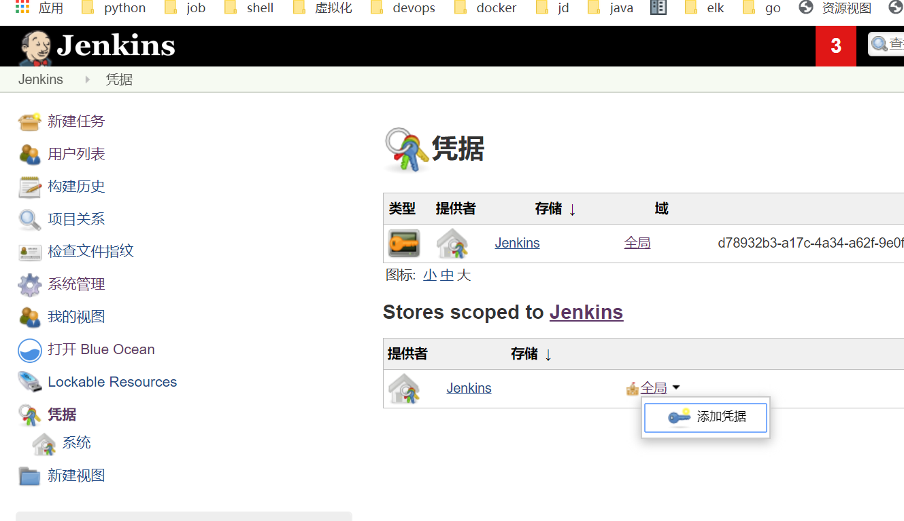
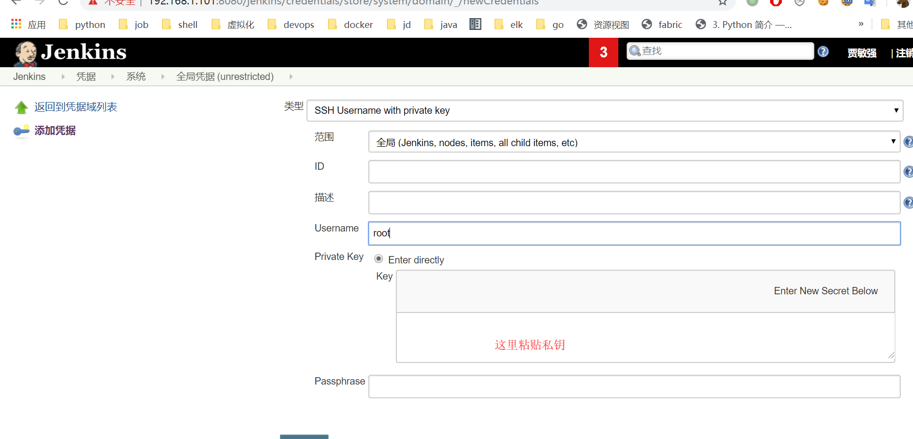
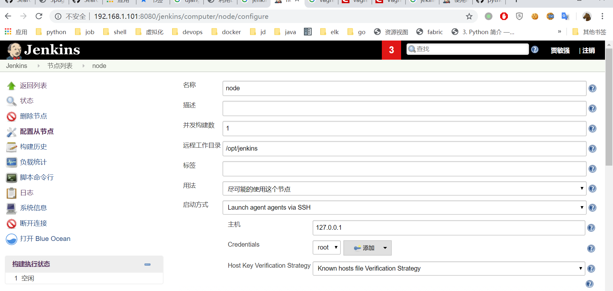
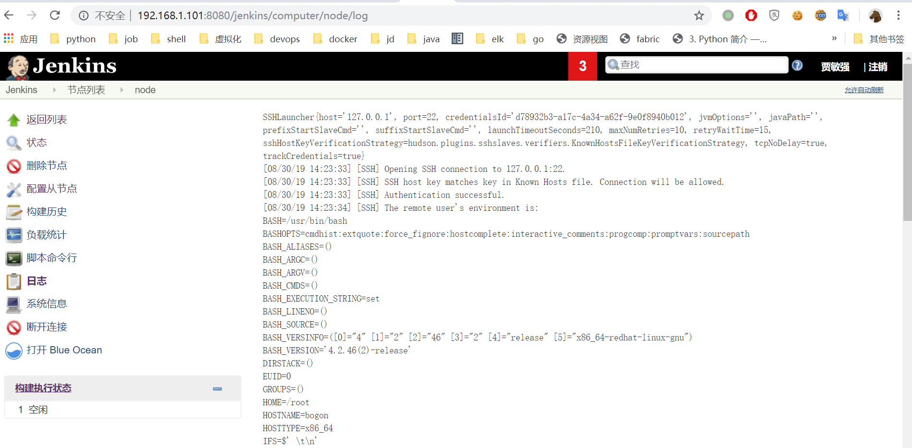
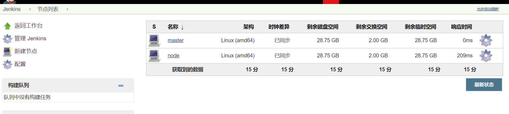
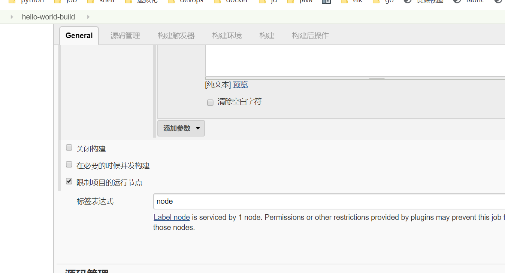

# 第16天

## 分布式jenkins
jenkins-凭据-添加凭据


配置凭据



jenkins-系统管理-节点管理-新建节点


环境变量
```
[root@bogon ~]# cat ~/.bashrc
# .bashrc

# User specific aliases and functions

alias rm='rm -i'
alias cp='cp -i'
alias mv='mv -i'

# Source global definitions
if [ -f /etc/bashrc ]; then
        . /etc/bashrc
fi

export JAVA_HOME=/opt/jdk
export MAVEN_HOME=/opt/maven

export PATH=$MAVEN_HOME/bin:$JAVA_HOME/bin:$PATH

```
最后点击保存

启动日志


节点列表


指定节点执行项目
自由项目


pipeline 项目
```
 agent { label 'node1'}
```

## 使用docker 启动jenkins

使用下面的 docker run 命令运行 jenkinsci/blueocean 镜像作为Docker中的一个容器(记住，如果本地没有镜像，这个命令会自动下载):

```
docker run \
  --rm \
  --name jenkins \
  -u root \
  -p 8080:8080 \
  -v /root/.jenkins:/var/jenkins_home \
  -v /var/run/docker.sock:/var/run/docker.sock \
  -d jenkinsci/blueocean
```

## jenkins http api

### 认证方式

jenkins使用basic基本认证方式

基本认证及在http请求的header部分添加
Authorization: Basic base64(user:passwd)

#### job 操作 

1. 获取job 

方法: GET 
URL: /job/{job_name}/api/json

2. 获取job 配置文件
方法: GET
URL: /job/{job_name}/config.xml

3. 创建job

URL: /createItem/api/json?name=xxx
方法: POST
数据类型: text/xml

数据内容:
```
<?xml version='1.1' encoding='UTF-8'?>
<project>
    <actions/>
    <description>api-test</description>
    <keepDependencies>false</keepDependencies>
    <properties>
        <hudson.plugins.jira.JiraProjectProperty plugin="jira@3.1.1"/>
    </properties>
    <scm class="hudson.scm.NullSCM"/>
    <canRoam>true</canRoam>
    <disabled>false</disabled>
    <blockBuildWhenDownstreamBuilding>false</blockBuildWhenDownstreamBuilding>
    <blockBuildWhenUpstreamBuilding>false</blockBuildWhenUpstreamBuilding>
    <triggers/>
    <concurrentBuild>false</concurrentBuild>
    <builders>
        <hudson.tasks.Shell>
            <command>echo &quot;start api-test&quot;
sleep 300
echo &quot;end api-test&quot;
</command>
        </hudson.tasks.Shell>
    </builders>
    <publishers/>
    <buildWrappers/>
</project>
```

4. 修改job

URL: /job/{job_name}/config.xml
方法: POST
数据类型: text/xml

数据内容:
```
<?xml version='1.1' encoding='UTF-8'?>
<project>
    <description></description>
    <keepDependencies>false</keepDependencies>
    <properties>
        <hudson.plugins.jira.JiraProjectProperty plugin="jira@3.1.1"/>
    </properties>
    <scm class="hudson.scm.NullSCM"/>
    <canRoam>true</canRoam>
    <disabled>false</disabled>
    <blockBuildWhenDownstreamBuilding>false</blockBuildWhenDownstreamBuilding>
    <blockBuildWhenUpstreamBuilding>false</blockBuildWhenUpstreamBuilding>
    <triggers/>
    <concurrentBuild>false</concurrentBuild>
    <builders>
        <hudson.tasks.Shell>
            <command>echo &quot;start api-test&quot;
sleep 300
echo &quot;end api-test&quot;
</command>
        </hudson.tasks.Shell>
    </builders>
    <publishers/>
    <buildWrappers/>
</project>
```

5. 获取所有jobs
方法: GET
URL: /api/json

### build操作

1. 获取build 信息
方法: GET
URL:  /job/{job_name}/{id}/api/json

2. 获取构建日志信息

方法: GET
URL: /job/{job_name}/{id}/logText/progressiveText

3. 开始构建

非参数话
方法: POST 
URL: /job/{job_name}/build/api/json


参数化构建
方法: POST 
URL: /job/{job_name}/build/api/json
数据类型: x-www-form-urlencoded
数据: 
```
json='{
	"parameter": [{
		"name": "tag",
		"value": "1.0"
	}]
}'
```

需要禁止csrf否则返回403这个与django一样
禁止csrf
jenkins-系统管理-全局安全配置-跨站请求伪造保护 去掉勾

否则需要先获取crumb
/crumbIssuer/api/json?pretty=true
然后在请求中添加header
Jenkins-Crumb: xxxxxxxxxxxxxx

第二种方式：
使用api-token，生成token
点击当前用户-设置-api token-添加token

4. 停止构建

方法: POST
URL: /job/{job_name}/{id}/stop

### queue 操作
1. 获取构建队列中的job

方法: GET
URL: /queue/api/json

2. 取消构建队列中的job

方法：POST
URL: /queue/cancelItem?id={id}


练习：
1. 使用python 编写脚本现实以上接口调用，完成的同学截个图

提示使用python的requests模块

requests 基本认证

```
requests.get('https://api.github.com/user', auth=('user', 'pass'))
```

2. 使用[python-jenkins模块](https://python-jenkins.readthedocs.io/en/latest)

作业：
写构建部署平台使用django